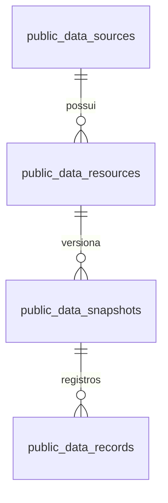

# Diretório de dados públicos e contas de Minas Gerais

Status: plano geral; primeira fatia de persistência autorizada pelo usuário em 08/10/2026. Investigação inicial na mesma data.

O primeiro produto será uma trilha que explica onde obter os dados, como consultá-los e quais validações são necessárias. A implementação deve ampliar o catálogo existente no backend, persistir o conhecimento no Supabase e apresentar seis cards em coluna única. O frontend não será responsável pelas URLs ou pela curadoria das fontes.

As consultas realizadas confirmaram dados de receita, execução da dívida, despesa por empenho, Siconfi e PIB. Também revelaram recursos com HTTP 200 e nenhum registro. Por isso, a capacidade de mostrar dados precisa ser definida por recurso e consulta, com evidência; localizar documentação não basta.

A etapa inicial foi somente documental. Posteriormente, o usuário autorizou preparar a infraestrutura no Supabase existente e persistir os dados coletados. Essa autorização cobre a primeira fatia descrita abaixo; a interface completa da trilha e os demais adaptadores continuam nas fases seguintes.

### Primeira fatia autorizada: persistência de receita

- Storage privado `official-data`, originais imutáveis identificados por SHA-256; limite de 6 MiB por arquivo nesta entrega.
- Postgres: `public_data_sources` → `public_data_resources` → `public_data_snapshots`; tabela genérica de registros `public_data_records`.
- Catálogo inicial: receita de Minas, metadados CKAN e datapackage oficial, fato realizado v2018 e as dimensões referenciadas. Não misturar receita prevista, série anterior a 2018 ou dados de outras etapas.
- RLS habilitada, sem acesso direto de anon/authenticated; service role exclusiva do backend/importador. Rotas públicas Express expõem apenas fontes oficiais e versões prontas. Não modificar users, dossiers ou políticas existentes.
- Snapshot registra original, hash do contrato (schema + dependências), versão do parser, URL, horário de coleta, contagem e validação. Publicação atômica por RPC invoker, restrita à service role, confere a contagem e altera o ponteiro da versão ativa. Falha conserva o ponteiro anterior; versões antigas permanecem para auditoria.
- Importação administrativa via CLI, fora da requisição do visitante; sem cron/filas adicionais nesta fatia. Consulta paginada ao banco, preservando valores monetários como decimal textual na API.
- Rollback lógico: retirar as novas rotas/CLI ou apontar novamente para um snapshot validado anterior pela RPC. Não excluir dados antigos automaticamente.
- Cenários obrigatórios: gzip/CSV/schema inválidos, vazio não equivale a zero, decimal exato e valores negativos, dimensão sem chave única, importação repetida sem duplicatas, falha sem trocar versão ativa, consulta paginada sem chamada ao governo, anon sem acesso ao banco/Storage.
- DDL via Management API, validado primeiro com rollback; SQL temporário fora do repositório. Contrato e operação documentados em `backend/docs/official-data.md`.

Esta fatia antecipa a persistência que o plano original deixava para a fase 8. O modelo completo de trilhas poderá referenciar as fontes e recursos existentes, sem duplicar originais nem fixar os seis cards no frontend.

A infraestrutura implementada é genérica: pipeline `importOfficialData`, quatro tabelas compartilhadas e rotas por fonte/recurso. Minas fica somente no adaptador. A primeira carga preservou 14 originais e 77.755 registros de receita (2018–2026); reexecuções não duplicaram a receita. Quatro dimensões vieram vazias e duas incompletas: cinco relações foram validadas, seis permanecem pendentes, documentadas no snapshot. A interface e os demais adaptadores ainda não foram implementados nesta fatia. Evidências e operação: [official-data.md](../../../../backend/docs/official-data.md).

### Ampliação autorizada: originais do catálogo existente

Em 08/10/2026, o usuário priorizou preservar todos os arquivos já cadastrados antes de desenvolver as trilhas, limitando expressamente esta coleta ao catálogo de arquivos. O mesmo pipeline preservou 40 arquivos do Senado e 17 respostas SOAP XML de São Paulo (2010–2026), derivados de `DataCatalogModel`, sem duplicar a lista de URLs. Bases das telas legislativas permanecem fora deste escopo.

Os 57 recursos estão prontos no Storage privado, com requisição, período, hash e evidências registrados no Postgres. Usam `kind=document`: nesta ampliação, não foram duplicadas linhas analíticas. Os previews existentes foram alterados para ler os originais preservados, conferindo o hash e reaplicando localmente os filtros já existentes. Todos os 57 previews foram testados com acesso ao governo bloqueado; a reutilização das 57 versões foi conferida sem novos uploads. Cinco suítes filtradas passaram, com 32 testes. O bucket inteiro passou a conter 71 objetos, aproximadamente 19,7 MB.

Não houve novas tabelas/RPCs nem publicação de backend nesta ampliação. Atualização administrativa segue pela CLI `npm run data:import -- catalog`; cron, cache de parsing e paginação analítica permanecem para fases posteriores. As entidades e a interface de trilhas continuam pendentes.

### Ampliação autorizada: arquivos legislativos e inventário histórico

O usuário ampliou expressamente o escopo para Câmara e Senado, selecionando legislatura atual e cadastros necessários, com aproveitamento do histórico quando viável. Antes de desenvolver trilhas, registrar também recursos ainda não coletados, distinguindo identificação de acesso testado.

Execução: descobrir o índice JSON publicado na página da Câmara (sem executar scripts) e os downloads anunciados nas páginas legislativas do Senado; preservar os catálogos/dicionários oficiais. Cadastrar o histórico e formatos alternativos no Postgres existente, por lotes; coletar arquivos da 57ª legislatura, cadastros compartilhados e histórico anual de votações da Câmara desde 2000, conforme períodos anunciados. No Senado, preservar os extratos publicados e consultas anuais de 2000–2026, sem confundir CSV dos últimos 12 meses ou respostas anuais vazias com histórico completo.

Arquivos de texto maiores são preservados com gzip reversível: registrar formato original, tamanho, SHA-256 do conteúdo oficial e SHA-256 do objeto armazenado. O usuário posteriormente autorizou ampliar o teto inicial de 6 MiB para 30 MiB, alinhando código, bucket privado e constraint dos snapshots. DDL validado em rollback e aplicado com commit pela Management API; nenhum novo objeto de banco. Download/descompactação legislativa ficam limitados a 128 MiB; recursos acima dos limites são registrados como pendentes. A coleta histórica foi explicitamente limitada a 2000 em diante; períodos anteriores permanecem identificados e originais já coletados não são apagados. A consulta dos arquivos preservados e o inventário devem ser validados após a carga, com as origens governamentais bloqueadas. Evidências finais ficam em `backend/docs/official-data.md`.

Resultado de 09/10/2026 (UTC): Câmara com 871 recursos catalogados, 238 disponíveis, 631 identificados sem coleta e dois links com 404 (`historico`, `membros`); Senado com 389 catalogados, 141 disponíveis e 248 identificados sem coleta. Os CSVs oficiais resolveram quatro recursos grandes/incompletos; a retomada resolveu 503 do Senado em 2012. As 27 respostas anuais de 2000–2026 foram preservadas sem declarar cobertura semanticamente completa. O bucket, incluindo fontes anteriores e versões/tentativas, contém 481 objetos e 328.381.030 bytes; não há snapshots em staging ou acima do teto. Os 379 originais ativos foram lidos pelo Model e tiveram seus hashes conferidos, com origens governamentais bloqueadas e zero chamadas externas; inventário, quatro downloads assinados e rejeições de recursos indisponíveis/documentos não tabulares passaram pela API local. Cinco suítes filtradas passaram, com 32 testes. Nenhum deploy nesta fase.

Antes das trilhas fiscais, a próxima entrega sugerida pelo usuário é substituir as consultas externas dos leitores das telas legislativas por snapshots preservados. O frontend já usa o backend próprio. Os JSONs de senadores em exercício e votações anuais correspondem às requisições do Senado. Na Câmara, adaptar votos do CSV mantendo normalização/placares e preservar a API paginada de deputados em exercício; o cadastro histórico de 7.889 pessoas não substitui a lista atual. Preservar também as respostas específicas de `/processo` usadas pela trilha legislativa existente. Reutilizar models, rotas e normalizadores, sem exigir novas tabelas antes de comprovar demanda analítica. Critério: listas e detalhes de ambas as Casas funcionam com caches em memória vazios e todas as origens governamentais bloqueadas; falha de Storage/banco não dispara fallback externo silencioso, e a data de coleta continua sendo a real do snapshot.

Implementação autorizada pelo usuário: acrescentar leitura genérica de documentos prontos por URL no `OfficialDataModel`, reutilizando a verificação SHA-256; adaptar `fetchCamara` ao CSV de votos e `fetchSenado` aos JSONs preservados. Dois adaptadores adicionais, no mesmo importador, preservam as páginas de deputados em exercício e as consultas de tramitação derivadas da configuração existente. Publicar a primeira página de deputados por último, vinculada aos snapshots das demais páginas; leitores seguem essas versões fixadas. Manter a data real de coleta nos payloads. Validar normalização, ausência/falha de arquivo, paginação completa e integridade; depois testar listas/detalhes HTTP com caches limpos e origens bloqueadas. Sem DDL, novos serviços externos, cron ou deploy; o usuário explicitamente restringiu esta entrega ao código normal.

Implementado e conferido em 09/10/2026 (UTC): fontes `camara-current-deputies` (seis páginas, 513 deputados, primeira página publicada por último) e `senado-current-processes` (consulta derivada da trilha existente); os consumidores mantêm as rotas e leem exclusivamente snapshots prontos do acervo, respeitando o ponteiro ativo e dependências fixadas. CSV de votos mantém a conferência dos placares. Datas dos payloads vêm dos arquivos usados, sem substituir pela hora da visita. Nove rotas HTTP responderam 200, cinco identificadores inexistentes responderam 404 e arquivo ausente foi recusado; caches limpos, 19 arquivos lidos e zero tentativas de acesso ao governo. Regressão dos 57 previews financeiros passou também sem governo. Quinze suítes filtradas, 90 testes distintos, passaram; diff sem erros de whitespace. Nenhum deploy ou commit. Gate restante: typecheck, lint e build executados pelo desenvolvedor, conforme a regra do repositório.

Fechamento para commits: o usuário autorizou explicitamente o agente a executar as validações, commit e push, mantendo a restrição de deploy. `npm run typecheck` e `npm run lint` passaram nos dois workspaces; lint sem avisos após corrigir as dependências do resumo por gestão. Build do backend passou. O build padrão do frontend foi bloqueado primeiro pelo download das fontes e depois pelos sockets internos do Turbopack (`EPERM`); o build de produção com `npm run build -w frontend -- --webpack` passou com acesso à rede, sem alterar a configuração. Duas suítes backend afetadas pelas correções do lint passaram (16 testes) e a suíte da tela passou (21 testes), incluindo regressões para causas de falha e atualização de totais sem consultas repetidas. Validação do Turbopack continua limitada pelo ambiente; não confundir esse resultado com aprovação do bundler padrão.

## Problema

A pergunta “se Minas fosse analisada como uma empresa, como entenderíamos sua situação financeira?” exige fontes com conceitos diferentes: arrecadação, execução orçamentária, desembolsos, estoques de dívida, demonstrativos fiscais e produção econômica.

O catálogo atual descreve arquivos e oferece previews, mas não representa perguntas de investigação, contratos técnicos versionados, evidências de verificação ou relações entre fontes. O roadmap atual representa o desenvolvimento de integrações; não deve ser confundido com a sequência de uma investigação.

## Solução

Reutilizar a arquitetura Controller → Model → Database, a API de fontes, a página Fonte de Dados, o transporte oficial e os componentes existentes. Acrescentar um catálogo persistente de metadados e uma entidade própria de trilha.

Separar três responsabilidades:

1. Catálogo: descoberta, documentação, recursos, conceitos e evidências.
2. Consulta: leitura paginada das versões preservadas no banco; acesso direto ao recurso oficial somente quando ainda não há adaptador persistente.
3. Análise futura: dados reconciliados, normalizados e ligados à evidência de origem.

O catálogo não será um banco de todas as transações do Estado. A primeira entrega não precisa de crawler geral, índice vetorial, filas, novo serviço ou infraestrutura adicional.

## A Diagnóstico do projeto

### Estrutura e tecnologias

| Área | Estado confirmado | Consequência para o plano |
|---|---|---|
| Monorepo | npm workspaces, backend e frontend, lockfile na raiz | Preservar estrutura e dependências |
| Frontend | Next.js 16, React 19, TypeScript, Tailwind 3, Radix/shadcn e Lucide | Usar a UI existente |
| Backend | Node.js, Express 5, TypeScript e supabase-js | Implementar no monólito atual |
| Banco | Supabase PostgreSQL, cliente service role lazy no backend | Persistência exclusivamente pela camada Model |
| Autenticação | Supabase Auth, Bearer JWT, middleware e papéis user/admin | Leitura pública; gravações protegidas |
| Testes | Jest/ts-jest no backend; next/jest, jsdom e Testing Library no frontend | Testes filtrados por arquivo |
| Arquivos | xlsx e parsers CSV/JSON; transporte HTTPS centralizado | Reutilizar com limites e formatos explícitos |
| Documentos | Dossiês Markdown e PDF com react-pdf e pdfjs | Reutilizar mecanismos de exportação |
| Deploy | Dockerfiles e workflow Azure | Nenhum novo provedor nesta funcionalidade |

Arquivos e comportamento confirmados:

- [DataCatalogModel](../../../../backend/src/models/DataCatalogModel.ts) mantém quatro conjuntos curados em memória: dotações/despesas, receitas próprias e demonstrações do Senado, além de investimentos de São Paulo. Não consulta tabela de catálogo.
- [DataRoadmapModel](../../../../backend/src/models/DataRoadmapModel.ts) deriva itens disponíveis do catálogo e mantém itens futuros no backend.
- [dataCatalogRoutes](../../../../backend/src/routes/dataCatalogRoutes.ts) expõe GET /data-sources, GET /data-sources/roadmap e GET /data-sources/files/:id/preview.
- [DataCatalogController](../../../../backend/src/controllers/DataCatalogController.ts) resolve o arquivo por ID conhecido. A URL não vem da requisição do visitante.
- O preview pagina a apresentação, mas baixa e processa o arquivo antes de paginar. Paginação da tela não limita o download nem o uso de memória.
- [fetchSourceFile](../../../../backend/src/utils/fetchSourceFile.ts) e [officialHttpGet](../../../../backend/src/utils/officialHttpGet.ts) tratam timeout, redirecionamento e particularidades TLS. Adaptadores novos devem usar o transporte centralizado.
- [parseSpreadsheet](../../../../backend/src/utils/parseSpreadsheet.ts) oferece leitura CSV/JSON/XLSX e filtros. O contrato público DataFile só enumera CSV/JSON/XML: suporte interno a planilha não significa suporte público a XLS, ZIP, gzip ou PDF.
- [FonteDeDadosView](../../../../frontend/app/(dashboard)/fonte-de-dados/FonteDeDadosView.tsx) contém cards de conjuntos, seleção de edições, tabelas, filtros, diálogos e roadmap. O roadmap usa múltiplas colunas; a trilha nova terá uma coluna em qualquer breakpoint.
- [dataCatalogSearch](../../../../frontend/lib/dataCatalogSearch.ts) faz busca lexical sem acentos, exigindo todos os termos. Não interpreta perguntas livres nem relaciona automaticamente “arrecada” a “receita”.
- [dataCatalogService](../../../../frontend/services/dataCatalogService.ts) usa apiClient e o envelope padronizado. Não espalhar fetch no frontend.
- /fonte-de-dados já é pública em [publicRoutes](../../../../frontend/lib/publicRoutes.ts), embora esteja no grupo que apresenta a sidebar. Ampliar essa página evita criar uma rota pública com organização divergente.
- O modelo de dossiê tem sourceId único e codeCommit obrigatório. Um PDF da trilha precisa representar várias fontes e uma revisão do catálogo; não cabe sem adaptação no contrato editorial atual.

### Banco real

O acesso foi confirmado após a recuperação do serviço: projeto ACTIVE_HEALTHY e consulta SQL de leitura pela Supabase Management API via curl, com resposta HTTP 201 e resultado JSON. As falhas HTTP 544 e COMING_UP anteriores foram transitórias; não permanecem como impedimento da modelagem.

O schema public contém somente estas tabelas:

| Tabela | Estrutura relevante | Regras confirmadas |
|---|---|---|
| users | id uuid; email; name; avatar_url; role; status; onboarded_at; created_at; updated_at | FK para auth.users; role user/admin; status active/disabled; RLS habilitado; SELECT e UPDATE próprios por auth.uid() |
| dossiers | id uuid; slug; draft jsonb; published jsonb; submitted_by; published_by; datas de criação, rascunho e publicação | slug único; FKs para users; constraints do JSON; publicação completa ou ausente; RLS habilitado |

Não há tabelas de catálogo, recursos, trilhas ou indicadores em public. A consulta a pg_policies retornou policies somente para users; o acesso editorial a dossiers passa pelo backend privilegiado. RLS habilitado, isoladamente, não comprova o comportamento com anon/JWT.

A aplicação de futuras alterações seguirá [.claude/CLAUDE.md](../../../../.claude/CLAUDE.md), seção Banco de dados: Management API via curl, SQL temporário fora do repositório, payload JSON estruturado e conferência das pós-condições. Não criar migrations .sql no repositório.

### Documentação e arquitetura existentes

O [plano de arquitetura evolutiva](../estruturando-arquitetura/arquitetura-evolutiva-catalogo-dominios.plan.md) já distingue catálogo, preview e ingestão durável. Sua recomendação inicial de catálogo em TypeScript atendia uma curadoria pequena. A necessidade explícita de trilhas reutilizáveis e histórico de verificações justifica agora propor persistência de metadados, preservando essa separação.

O grafo Graphify foi consultado. Ele foi construído em c9b5004b, anterior ao código analisado, 589d5757226006f54b8e4588da883c026e45051b. Não contém os símbolos atuais do catálogo; referências de reaproveitamento foram confirmadas diretamente no código. Não atualizar o grafo nesta etapa de documentação.

## B Inventário das fontes oficiais

“Período publicado” descreve a oferta do portal. “Período observado” exige registros efetivamente lidos. Uma amostra de três linhas não confirma a integridade anual.

Todos os resultados abaixo correspondem à investigação de 08/10/2026. URLs e cobertura devem ser revalidadas no cadastro.

| Etapa | Fonte | URL oficial | Tipo de acesso | Período | Status de verificação |
|---|---|---|---|---|---|
| 01 | CGE MG, Receita pública | [Receita](https://dados.mg.gov.br/dataset/receita) | CKAN, datapackage JSON, CSV gzip | Observado: 2002–2017 e 2018–2026 em recursos distintos | Metadados e CSVs consultados; DataStore testado sem registros |
| 02 | CGE MG, Despesa pública histórica | [Despesa](https://dados.mg.gov.br/dataset/despesa) | CKAN, datapackage, CSV gzip | Publicado: 2002–2026; testes em 2024, 2025 e 2026 | Arquivos desses três anos retornaram HTTP 200, somente cabeçalhos |
| 02 | CGE MG, Despesa por Empenho | [Despesa por Empenho](https://dados.mg.gov.br/pt_BR/dataset/portal_despesa_empenho) | CKAN, datapackage, CSV | Desde 2022 declarado; amostra de 2025 consultada | HTTP 200, schema e três registros consultados; totais não reconciliados |
| 02 e 04 | CGE MG, Despesas com restos a pagar | [Restos a pagar](https://dados.mg.gov.br/dataset/restos_pagar) | CKAN, datapackage, CSV gzip | Publicado: 2002–2026; testes em 2024–2026 | Metadados consultados; arquivos testados somente com cabeçalhos |
| 01 e 02 | Portal da Transparência MG | [Portal](https://www.transparencia.mg.gov.br/) | Consulta manual | Depende da consulta | GET da homepage retornou 403 neste ambiente; navegação manual pendente |
| 03 e 04 | SEF MG, Boletins da Dívida Pública | [Boletins](https://www.fazenda.mg.gov.br/tesouro-estadual/divida-publica/boletins-da-divida-publica/) | Página e PDF mensal | Links observados: jan/2020–ago/2026; PDF de ago/2026 consultado | Fonte e documento consultados; série completa e contratos individuais pendentes |
| 04 | CGE MG, Despesas com dívida pública | [Execução da dívida](https://dados.mg.gov.br/dataset/execucao-da-divida) | CKAN, datapackage, CSV gzip | Observado: 2002–2026 | HTTP 200; schema e 9.150 registros lidos; encargos separados ainda não esclarecidos |
| 05 | Tesouro Nacional, Siconfi | [Documentação](https://apidatalake.tesouro.gov.br/docs/siconfi/) | API REST JSON e Swagger YAML | 2025 consultado; cobertura dos demais exercícios a verificar | /entes, /rreo, /rgf e /dca consultados para MG |
| 06 | IBGE, Contas Regionais | [Arquivos de 2023](https://ftp.ibge.gov.br/Contas_Regionais/2023/xls/) | HTTPS, índices TXT, ZIP com XLS; diretório ODS localizado | Pacote regional 2010–2023 consultado; pacote 2002–2023 localizado | ZIP de tabelas especiais aberto; tab01.xls contém MG e PIB corrente |
| 06 | IBGE, agregado 5938 | [Metadados da API](https://servicodados.ibge.gov.br/api/v3/agregados/5938/metadados) | API de agregados JSON | Metadados: 2002–2023; consulta MG/2023 testada | API e dados consultados; origem é PIB dos Municípios, com nível UF disponível |

### Evidências de acesso e limites

1. GET https://dados.mg.gov.br/api/3/action/package_show?id=receita retornou HTTP 200 e success=true. O mesmo ocorreu para despesa, execucao-da-divida, restos_pagar e portal_despesa_empenho.
2. Os cinco datapackage.json foram baixados e interpretados. Há schema, codificação, delimitador e relações; isso não comprova que todas as relações estão corretas.
3. Receita antiga: ft_receita.csv.gz teve 116.910 registros e anos 2002–2017. Receita v2018: 77.755 registros e anos 2018–2026. Os números são contagens de validação, não respostas sobre arrecadação.
4. A receita prevista v2018 teve cabeçalho e três linhas lidos. Sua série completa não foi validada.
5. O DataStore de receita v2018 retornou success=true, fields e total=0. O recurso declara datastore_active=true. Isso não é evidência de ausência de arrecadação: o CSV correspondente contém registros.
6. ft_despesa_2024/2025/2026.csv.gz e ft_restos_pagar_2024/2025/2026.csv.gz retornaram HTTP 200, cabeçalhos e zero linhas de dados. Não usar esses retornos como gasto zero.
7. empenho2025.csv retornou três linhas na amostra. Seus valores financeiros são descritos como string no schema.
8. O PDF de agosto/2026 foi lido. Apresenta estoque por credor/indexador e amortização separada de “juros e encargos”, além de execução orçamentária e financeira.
9. Siconfi 2025: RREO Anexo 03, 6º bimestre, retornou 420 itens; RGF Anexo 02, Executivo, 3º quadrimestre, 113 itens; DCA, 3.568 itens. As três respostas tinham hasMore=false.
10. O agregado IBGE 5938 retornou a variável 37 para Minas Gerais, nível N3, ano 2023, em Mil Reais. O ZIP regional Especiais_2010_2023_xls.zip teve tab01.xls aberto; essa tabela expressa PIB em milhões de reais. A igualdade dos valores, após conversão e arredondamento, ainda será reconciliada.

O bloqueio 403 do portal e da página principal do IBGE é um resultado neste ambiente, não uma afirmação de indisponibilidade geral. Os caminhos alternativos oficiais acessados estão registrados acima.

### Recursos concretos localizados

| Uso | Recurso |
|---|---|
| Dicionário de receita | [datapackage de receita](https://dados.mg.gov.br/dataset/6e7d2c52-a3ef-4f0a-92f8-c09a17b499e2/resource/f5dbe6c2-380b-4e89-bb5a-37a4d08f7bed/download/datapackage.json) |
| Receita realizada desde 2018 | [ft_receita_v2018.csv.gz](https://dados.mg.gov.br/dataset/6e7d2c52-a3ef-4f0a-92f8-c09a17b499e2/resource/488184ca-c705-4ae9-b93c-dd6bc660a768/download/ft_receita_v2018.csv.gz) |
| Receita prevista desde 2018 | [ft_receita_prevista_v2018.csv.gz](https://dados.mg.gov.br/dataset/6e7d2c52-a3ef-4f0a-92f8-c09a17b499e2/resource/185b62cd-bf81-454b-a435-6b5bbfa07f69/download/ft_receita_prevista_v2018.csv.gz) |
| Dicionário da despesa histórica | [datapackage de despesa](https://dados.mg.gov.br/dataset/eb709e1d-c19e-4371-b1ea-436920cf537a/resource/67bfcc88-66e4-4a65-b46e-4fba788c4496/download/datapackage.json) |
| Despesa por empenho em 2025 | [empenho2025.csv](https://dados.mg.gov.br/dataset/8a9482f1-8d9e-49bd-8c58-d1574cb2843b/resource/2ef02d2b-655e-44a0-aaeb-bdac5c222871/download/empenho2025.csv) |
| Dicionário da dívida | [datapackage da execução da dívida](https://dados.mg.gov.br/dataset/6972dbe5-82c0-4ac8-aac9-4258efc3e483/resource/87a12e9b-b223-467e-8816-455742ad2fc1/download/datapackage.json) |
| Fluxos de execução da dívida | [ft_divida_pub.csv.gz](https://dados.mg.gov.br/dataset/6972dbe5-82c0-4ac8-aac9-4258efc3e483/resource/100ba5a6-5cd3-4b73-9b7f-d47c93d56658/download/ft_divida_pub.csv.gz) |
| Boletim consultado | [Boletim de agosto de 2026](https://www.fazenda.mg.gov.br/export/sites/fazenda/tesouro-estadual/divida-publica/boletins-da-divida-publica/agosto-de-2026/Boletim-SCGOV-Agosto.pdf) |
| Contrato Siconfi | [Swagger YAML](https://apidatalake.tesouro.gov.br/docs/siconfi.yaml) |
| PIB estadual corrente e séries | [Especiais_2010_2023_xls.zip](https://ftp.ibge.gov.br/Contas_Regionais/2023/xls/Especiais_2010_2023_xls.zip) |

Os datapackages mineiros descrevem CSV UTF-8 com BOM e delimitador ponto e vírgula. Separar formato CSV de compressão gzip no contrato. Descobrir URLs por metadados e conservar os identificadores oficiais; não construir caminhos por suposição.

## C Plano de investigação

### Procedimento comum

Para cada recurso, registrar URL solicitada e final, método, parâmetros, instante UTC, HTTP, content type, versão do contrato, hash quando houver corpo completo, número de linhas examinadas, campos, período observado, resultado e limitações. Separar atualização declarada pelo órgão da data da verificação.

Requisições de investigação são de leitura. Retornos de erro ou arquivos vazios nunca se transformam em zero financeiro. Exemplos publicados devem poder ser repetidos; remover credenciais e dados pessoais das evidências públicas.

### Etapa 01 Receita do Estado

Pergunta: quanto Minas arrecada e de onde vem o dinheiro?

1. Registrar CGE como publicadora do conjunto e investigar separadamente o órgão produtor e o perímetro contábil.
2. Mapear os recursos antes e depois de 2018, sem concatenar códigos de classificações diferentes.
3. Usar vr_efetivado para receita efetivada ajustada e preservar vr_previsto_inicial e vr_previsto_atual como medidas distintas.
4. Ler dimensões de origem, espécie, fonte, unidade e tempo; validar unicidade das chaves e cobertura dos registros.
5. Agregar realizado por exercício e natureza. Agregar a previsão anual na mesma granularidade antes de relacioná-la aos movimentos mensais, para não multiplicá-la.
6. Verificar deduções, receitas intraorçamentárias, receitas de capital e operações de crédito. Receita orçamentária não é automaticamente receita recorrente nem Receita Corrente Líquida.
7. Reconciliar um exercício fechado com RREO Anexo 01 e DCA, documentando ajustes de escopo.

Consulta testada de metadados:

~~~http
GET https://dados.mg.gov.br/api/3/action/package_show?id=receita
~~~

Parâmetro obrigatório: id. Resposta observada: success e result.resources, com IDs, URLs e formatos. Não houve autenticação nas consultas testadas.

Consulta testada de DataStore:

~~~http
GET https://dados.mg.gov.br/api/3/action/datastore_search?resource_id=488184ca-c705-4ae9-b93c-dd6bc660a768&limit=1
~~~

Resultado: total=0 e records vazio. O CSV será o caminho inicial para consulta de conteúdo. resource_id é obrigatório; limit, offset e filters são parâmetros documentados pelo [CKAN](https://docs.ckan.org/en/latest/maintaining/datastore.html), cuja disponibilidade e limites nesta instalação devem ser medidos antes de uso operacional.

Lacuna concreta: a descrição de id_tempo menciona dimensão diária, mas a relação do recurso v2018 aponta dm_tempo_mensal. Validar o vínculo com as linhas e a dimensão publicada; não interpretar o ID como data.

### Etapa 02 Despesas do Estado

Pergunta: quanto Minas gasta, em quais funções e para quais favorecidos?

1. Catalogar a base histórica e Despesa por Empenho como conjuntos distintos, com a relação “substituição ou complemento a validar”.
2. Repetir o download dos arquivos históricos sem linhas e verificar o portal manualmente. A base nova é candidata para exercícios recentes, não substituta automaticamente equivalente.
3. Na base histórica, preservar vr_empenhado, vr_liquidado e vr_pago. Na nova, preservar valor_despesa_empenhada, valor_despesa_liquidada, valor_pago_financeiro, valor_liquidado_rp e valor_pago_rp.
4. Verificar se as linhas são movimentos ou saldos acumulados por empenho; testar estornos, duplicidade e pagamentos posteriores. Não somar snapshots sucessivos.
5. Classificar áreas por função/subfunção quando disponíveis. Na base nova, essas classificações não aparecem no cabeçalho consultado; buscar recurso oficial complementar, sem inferir função a partir do nome do órgão.
6. Relacionar favorecidos por códigos oficiais e contexto de exercício/unidade. Não divulgar CPF desnecessariamente nos previews e exemplos públicos.
7. Investigar restos a pagar para separar exercício de origem, liquidação e desembolso no ano. Confirmar se a base nova já contém os mesmos pagamentos de RP antes de combiná-la com outra fonte.
8. Reconciliar empenhado e liquidado com RREO Anexos 01/02; desembolsos com demonstrativos financeiros compatíveis.

O schema histórico de 2025 relaciona id_empenho à dimensão dm_empenho_desp_2024. Esse vínculo não está aprovado: comparar dimensão de 2025, unicidade e correspondência dos registros assim que os dados históricos voltarem a conter linhas.

A documentação de vr_pago também registra movimentações escriturais/apropriações e possibilidade de pagamento efetivo pendente. Portanto, “pago” nesse arquivo não deve ser apresentado como saída bancária sem qualificação.

Critério de conclusão da investigação: ao menos um exercício com dados não vazios, granularidade documentada, classificação funcional validada ou lacuna explícita, e reconciliação por estágio. Acesso a uma amostra não habilita totais anuais.

### Etapa 03 Dívida Pública

Pergunta: quanto Minas deve, a quem e sob quais condições?

1. Inventariar cada PDF por competência e data de publicação, incluindo lacunas e revisões.
2. Extrair estoque, credor, indexador, unidade e data-base; registrar página e tabela.
3. Selecionar dezembro de cada exercício para a série anual. Estoques mensais não se somam.
4. Comparar o estoque SEF com dívida consolidada e dívida consolidada líquida do RGF Anexo 02, começando pela definição e pelo perímetro de cada medida.
5. Consultar dm_contrato_divida e dm_favorecido da execução para descobrir rótulos/identificadores. A dimensão de execução não comprova saldo, prazo ou indexador contratual.
6. Localizar contratos e aditivos oficiais para taxa, moeda, prazo, carência, garantias e cronograma. Não assumir uma API de contratos ou um campo inexistente.
7. Documentar renegociações, capitalização, variações cambiais, suspensões e alterações de data-base.

O boletim de agosto/2026 registra alterações na metodologia de atualização dos saldos em fevereiro/2026 e efeitos da renegociação com a União. Essas notas devem acompanhar a série; não interpretar toda variação de estoque como novo empréstimo.

Critério de conclusão: série com competências conferidas, estoques e conceitos separados, credores rastreáveis e condições contratuais verificadas ou marcadas como pendentes.

### Etapa 04 Juros e amortizações

Pergunta: quanto custa servir a dívida e quanto corresponde a principal?

1. Registrar ft_divida_pub como fluxo de execução, não estoque de dívida.
2. Preservar vr_juros e vr_amortizacao; relacionar id_contrato, id_favorecido, id_tipo e id_tempo com suas dimensões.
3. Validar granularidade dos movimentos, sinais, estornos e unidade antes de agregar por ano/contrato.
4. Investigar a definição de vr_juros: o schema consultado não esclarece se inclui outros encargos e não apresenta coluna separada de encargos.
5. Confrontar os resultados com a seção “juros e encargos” do boletim e com grupos de natureza de despesa adequados. A classificação deve ser confirmada na edição aplicável da documentação contábil.
6. Separar execução orçamentária de financeira e verificar restos a pagar, capitalização e encargos incorporados ao estoque.
7. Não somar os registros de dívida aos mesmos pagamentos da execução geral da despesa.

Fórmula somente depois de validar o perímetro: serviço da dívida = amortização + juros + demais encargos incluídos na definição adotada. Com os recursos atuais, a separação entre juros puros e outros encargos permanece pendente.

Critério de conclusão: decomposição sem sobreposição, definição sustentada por documentação e reconciliação com boletins. Parcela não identificável deve ser apresentada como “juros e encargos agregados” ou “composição pendente”, conforme a fonte.

### Etapa 05 Indicadores fiscais

Pergunta: qual é a situação fiscal e como compará-la com outros estados?

Documentação e base confirmadas:

~~~text
GET https://apidatalake.tesouro.gov.br/ords/siconfi/tt/entes
GET https://apidatalake.tesouro.gov.br/ords/siconfi/tt/rreo
GET https://apidatalake.tesouro.gov.br/ords/siconfi/tt/rgf
GET https://apidatalake.tesouro.gov.br/ords/siconfi/tt/dca
~~~

/entes confirmou cod_ibge=31 para o Estado de Minas Gerais, esfera E. Não confundir esse código com o de um município.

| Endpoint | Obrigatórios na especificação | Opcionais na especificação |
|---|---|---|
| /rreo | an_exercicio, nr_periodo, co_tipo_demonstrativo, id_ente | no_anexo, co_esfera |
| /rgf | an_exercicio, in_periodicidade, nr_periodo, co_tipo_demonstrativo, co_poder, id_ente | no_anexo, co_esfera |
| /dca | an_exercicio, id_ente | no_anexo |

Exemplos efetivamente testados:

~~~http
GET https://apidatalake.tesouro.gov.br/ords/siconfi/tt/rreo?an_exercicio=2025&nr_periodo=6&co_tipo_demonstrativo=RREO&no_anexo=RREO-Anexo%2003&id_ente=31
GET https://apidatalake.tesouro.gov.br/ords/siconfi/tt/rgf?an_exercicio=2025&nr_periodo=3&in_periodicidade=Q&co_tipo_demonstrativo=RGF&no_anexo=RGF-Anexo%2002&co_poder=E&id_ente=31
GET https://apidatalake.tesouro.gov.br/ords/siconfi/tt/dca?an_exercicio=2025&id_ente=31
~~~

Resposta observada: items, hasMore, limit, offset, count e links. Cada linha é uma célula contábil identificada por anexo, conta e coluna, não um “indicador pronto”.

Campos observados no RREO/RGF incluem exercicio, periodo, periodicidade, instituicao, cod_ibge, uf, anexo, esfera, rotulo, coluna, cod_conta, conta e valor; no RGF há co_poder. A DCA tem estrutura anual distinta.

O [Tesouro Transparente](https://www.tesourotransparente.gov.br/consultas/consultas-siconfi/siconfi-api-de-dados-abertos) declara acesso sem identificação e padrão de 5.000 itens por página; as respostas consultadas confirmaram limit=5000. Paginação de múltiplas páginas e limites de uso ainda precisam de teste específico. Alguns links retornados apontaram para hostname interno Oracle; não segui-los automaticamente nem catalogá-los como URL pública. Usar a origem pública validada e confirmar os parâmetros de paginação.

Investigação:

1. Confirmar anos/períodos disponíveis por ente, declaração e anexo. Não presumir cobertura contínua.
2. Mapear RCL no RREO 03; execução no RREO 01/02; resultados primário/nominal no RREO 06; pessoal no RGF 01; DC/DCL no RGF 02; caixa/RP no RGF 05, conforme manual do exercício.
3. Selecionar conta, coluna, poder, período, versão e unidade; não somar linhas de subtotal com seus componentes.
4. Usar DCA para contexto patrimonial complementar: ativos, passivos e disponibilidade. Resultado orçamentário não é lucro empresarial nem variação patrimonial.
5. Localizar relatórios oficiais homologados/retificados e suas datas; confirmar se a API oferece informação de versão suficiente.
6. Comparar estados em um mesmo exercício e período, com conceitos e denominadores equivalentes.
7. CAPAG, se incluída depois, exige fonte/metodologia própria. Não confundi-la com nota de qualidade das informações do Siconfi.

Referência localizada para compatibilidade de 2026: [Regras de preenchimento RGF e MDF](https://siconfi.tesouro.gov.br/siconfi/pages/public/arquivo/conteudo/2026_Regras_Gerais_e_Instrucoes_de_preenchimento_RGF_04032026.pdf). O manual aplicável a 2025 deve ser identificado antes de transformar as consultas testadas em indicadores.

### Etapa 06 Economia de Minas

Pergunta: qual é o tamanho da economia estadual?

1. Usar Contas Regionais como fonte principal do PIB estadual anual e identificar edição, referência metodológica e revisões.
2. Registrar o ZIP regional, seu índice e a planilha específica. No pacote Especiais_2010_2023_xls.zip, tab01.xls apresenta PIB corrente; o índice também localiza participação e volume encadeado.
3. Não confundir “Conta da Produção”, valor bruto da produção, valor adicionado e PIB. O outro ZIP consultado organiza contas por território/atividade; seu índice identifica Minas na Tabela 20.
4. Registrar o agregado 5938 como recurso adicional da pesquisa PIB dos Municípios, com nível UF N3 disponível; reconciliar seu valor estadual com Contas Regionais.
5. Validar conversão: API em mil reais; tab01.xls em milhões de reais. Guardar unidade original e fator de conversão.
6. Confirmar anos efetivamente disponíveis antes de escolher o filtro. A cobertura testada termina em 2023; não preencher PIB de 2025/2026 com um ano antigo.
7. Comparar crescimento real por volume com a série própria, preservando sua base. Não interpretar crescimento nominal do PIB como crescimento real.

Consulta de dados testada:

~~~http
GET https://servicodados.ibge.gov.br/api/v3/agregados/5938/periodos/2023/variaveis/37?localidades=N3%5B31%5D
~~~

Estrutura observada: array de variáveis; id, variavel, unidade e resultados; cada resultado contém classificacoes e series; cada série contém localidade e serie, com valores por período.

Agregado, período e variável fazem parte do caminho; localidades é o filtro usado. Não houve autenticação. Limites de volume não foram medidos. A [documentação do IBGE](https://servicodados.ibge.gov.br/api/docs/agregados?versao=3) fornece recursos de metadados, períodos, localidades e variáveis; registrar os contratos efetivamente usados.

### Conexões entre as fontes

| Relação | Chaves e transformações | Validação necessária |
|---|---|---|
| Receita e despesa | Ente, exercício, período, perímetro; agregação separada das bases | Receita realizada e despesa empenhada para resultado orçamentário, conforme demonstrativo; pago para análise financeira distinta |
| Previsão e realização | Exercício, unidade e natureza compatíveis; realização mensal agregada antes do vínculo | Não replicar a previsão anual em cada mês |
| Execução e dimensões MG | ID técnico, recurso, edição e vigência | Testar PK/FK; IDs locais não são universais |
| Estoque e serviço da dívida | Competência/data-base, credor e contrato confirmado | Renegociação pode consolidar contratos; exige correspondência com vigência |
| SEF e Siconfi | Ente 31, mesma data-base, definições de dívida | Estoque SEF, DC e DCL podem ter perímetros diferentes |
| Dívida e PIB | Ente e mesmo ano; saldo de fechamento e PIB anual nominal | Converter unidades; não usar PIB de 2023 para rotular razão de 2025 |
| Comparação entre estados | Código do ente, demonstrativo, poder, exercício, período, coluna e unidade | Usar fonte padronizada; impedir comparação de ano completo com acumulado parcial |

Resultado orçamentário, resultado primário, resultado nominal e resultado patrimonial serão conceitos separados. Dívida/PIB dá contexto econômico; DCL/RCL responde a outra relação fiscal. RCL não é arrecadação total.

Não haverá junção direta por nomes de credores ou órgãos. Correspondências de contratos, naturezas ou unidades terão método, evidência, vigência e status de validação.

## D Proposta de modelagem

### Responsabilidades e relações

Entidades propostas, ainda inexistentes no banco:

| Estrutura | Responsabilidade |
|---|---|
| public_organizations | Órgãos publicadores, produtores e responsáveis |
| public_datasets | Base reutilizável, origem, licença, geografia e frequência |
| public_resources | Identidade estável de API, arquivo, página ou documento de uma base |
| public_resource_versions | URL, período, contrato e schema de uma revisão do recurso |
| source_verifications | Histórico imutável de verificações de uma revisão e consulta |
| indicator_concepts | Definição, unidade, base contábil, operação e referência oficial |
| investigation_trails | Pergunta geral, território, termos de busca e estado editorial |
| investigation_steps | Ordem sugerida, título, pergunta e instruções de uma trilha |
| investigation_step_sources | Vínculo N:N de etapas com bases/recursos/conceitos |
| source_relationships | Relações verificadas ou propostas entre recursos |

Uma base tem vários recursos; um recurso tem várias versões/verificações. Uma trilha tem várias etapas. A mesma base pode atender várias etapas e trilhas. Uma etapa pode utilizar fontes principal, complementar e de reconciliação.

Não criar uma tabela universal de observações financeiras nesta fase. Não copiar toda a execução mineira para PostgreSQL para poder exibir seis cards. Definir tabelas financeiras somente na fase 8, a partir da granularidade validada.

### Contrato de banco proposto

Notação: NN = NOT NULL; ? = nullable. Todas as estruturas abaixo serão criadas apenas depois da aprovação e de nova conferência do schema. UUID interno não substitui identificador oficial.

Convenções para as tabelas editoriais: id uuid NN PK DEFAULT gen_random_uuid(); created_at timestamptz NN DEFAULT now(); updated_at timestamptz NN DEFAULT now(); published boolean NN DEFAULT false nas entidades que precisam de rascunho. updated_at será atualizado explicitamente pelo Model. Recursos e vínculos só serão públicos quando suas entidades superiores estiverem publicadas.

| Tabela | Colunas específicas e tipos | Constraints e índices |
|---|---|---|
| public_organizations | slug text NN; name text NN; official_url text NN | UNIQUE slug; CHECK textos não vazios |
| public_datasets | slug/title/description/official_url text NN; publisher_id uuid NN FK organizações; producer_id/responsible_id uuid ? FK organizações; source_system jsonb ?; geography jsonb NN; update_frequency/license text ? | UNIQUE slug; índices FKs e slug; geography deve ser array |
| public_resources | dataset_id uuid NN FK bases; slug/title text NN; kind text NN; official_resource_id text ?; preview_capability text NN DEFAULT 'none' | UNIQUE slug; UNIQUE parcial dataset_id/official_resource_id quando não nulo; CHECK kind api/file/page/document; capacidade none/tabular/document |
| public_resource_versions | resource_id uuid NN FK recursos; revision integer NN; url text NN; method/format/compression text ?; contract_json jsonb NN DEFAULT '{}'; schema_json jsonb ?; reference_start/reference_end date ?; declared_updated_at timestamptz ?; collected_at timestamptz NN; evidence_url text NN; content_hash text ? | UNIQUE resource_id/revision; CHECK revision>0; CHECK período válido; schema/contrato objetos; índice recurso/revisão |
| source_verifications | resource_version_id uuid NN FK versões; checked_at timestamptz NN; operation text NN; outcome text NN; http_status integer ?; request_json/response_summary/evidence_json jsonb NN; observed_fields jsonb NN DEFAULT '[]'; observed_rows bigint ?; observed_start/observed_end date ? | Índice versão/checked_at DESC; HTTP 100–599 quando presente; observed_rows>=0; operation/outcome enumerados via CHECK |
| indicator_concepts | slug/name/definition text NN; unit/accounting_basis/value_kind text NN; calculation_json jsonb NN; official_reference_url text NN | UNIQUE slug; CHECK value_kind stock/flow/ratio/forecast; JSON de cálculo objeto |
| investigation_trails | slug/title/question/description text NN; geography jsonb NN; search_terms jsonb NN DEFAULT '[]'; revision integer NN DEFAULT 1 | UNIQUE slug; revision>0; search_terms array |
| investigation_steps | trail_id uuid NN FK trilhas; slug text NN; position integer NN; title/question text NN; instructions_json jsonb NN DEFAULT '{}'; optional boolean NN DEFAULT false | UNIQUE trail_id/position e trail_id/slug; position>0; índice trilha/ordem |
| investigation_step_sources | step_id uuid NN FK etapas; dataset_id uuid NN FK bases; resource_id uuid ? FK recursos; concept_id uuid ? FK conceitos; role text NN; notes text ? | Índices em todas as FKs; CHECK role primary/complementary/reconciliation; unicidade de vínculo com tratamento explícito de NULL |
| source_relationships | from_resource_id/to_resource_id uuid NN FK recursos; relation_type text NN; mapping_json jsonb NN; verification_status text NN DEFAULT 'proposed'; evidence_url text ?; valid_from/valid_to date ? | Índices nas duas FKs; proibir autorrelação; período válido; status proposed/verified/rejected |

Para tabelas append-only de versões e verificações, created_at basta; não adicionar updated_at editável. Versões publicadas não serão sobrescritas. Retificar evidência gera novo registro com referência ao anterior no evidence_json.

Todas as FKs de catálogo usarão ON DELETE RESTRICT. Alterar disponibilidade ou arquivar é preferível a apagar a evidência. UUIDs de vínculo continuarão independentes do formato dos códigos CKAN/IBGE.

Na fase de contrato, definir a unicidade de investigation_step_sources para as combinações com resource_id/concept_id nulos por índices parciais ou recurso do PostgreSQL confirmado no projeto; não depender da igualdade implícita de NULL.

### Contrato técnico e evidências

contract_json será JSON versionado e validado em TypeScript: endpoint, método, parâmetros com tipo/obrigatoriedade/default, exemplos, formato da resposta, seleção de campos, paginação, limites conhecidos, autenticação, instruções manuais e URLs de documentação.

schema_json preserva o schema oficial localizado. Correções interpretativas ficam em mapping_json/instructions_json, acompanhadas de evidência; não reescrever a documentação original como se o órgão a tivesse corrigido.

request_json contém uma requisição sanitizada; response_summary contém estrutura, contagens e amostra segura. evidence_json contém URL original/final, notas, localização de página/tabela, hash quando aplicável, revisão da curadoria e alcance do teste. Não guardar credenciais ou dumps pessoais.

Usar manifestos JSON de curadoria e resultados sanitizados, versionados no Git e importados por slug/revisão. O banco serve o catálogo operacional. Uma alteração editorial deve ter uma revisão rastreável; não editar o banco e o manifesto separadamente como duas fontes de verdade.

### Status e disponibilidade

Preservar os marcos históricos e apresentar separadamente o resultado atual:

| Marco ou resultado | Evidência mínima |
|---|---|
| Fonte identificada | Página oficial e órgão/base reconhecidos |
| Documentação localizada | Dicionário, manual, schema ou contrato efetivamente lido |
| Acesso testado | Requisição e resposta do recurso-alvo, inclusive resultado de falha |
| Dados consultados | Registros/documento lidos, com alcance e validação estrutural |
| Pendente | Não testado ou teste insuficiente para aquela capacidade/período |
| Indisponível | Falha observada, com data e contexto |
| Sem registros no retorno | Acesso respondeu, mas não trouxe conteúdo esperado |
| Estrutura divergente | Resposta não corresponde ao contrato esperado |

source_verifications.operation: metadata/access/data. outcome: success/empty/failed/schema_mismatch/pending.

O badge “Acesso testado com sucesso” exige resultado success da operação adequada. Arquivo apenas com cabeçalhos pode comprovar transporte, mas não dados consultados. Dados consultados no passado não escondem uma falha atual.

Separar capacidade de integração da fonte e marcos de verificação. O enum legado available/mapped/discovery poderá continuar no roadmap, derivado do contrato apropriado; não será usado como prova de acesso.

### Acesso e segurança

RLS habilitado nas dez tabelas novas. Preservar users/dossiers e suas regras.

Na primeira versão, Express é a superfície de leitura do catálogo e de escrita administrativa: revogar acesso direto das novas tabelas de anon/authenticated e conceder apenas as operações necessárias a service_role. Não criar policies públicas apenas por conveniência, views, RPCs, SECURITY DEFINER, Storage ou Realtime.

Rotas públicas consultam exclusivamente registros publicados e evidências sanitizadas. Rotas administrativas exigem supabaseMiddleware + requireAdmin; sucesso com service role não é prova de autorização. Havendo acesso direto pelo navegador no futuro, criar policies específicas e provar anon/JWT separadamente.

Na aplicação futura: inventariar grants reais, criar estruturas atomicamente, validar em transação com rollback, obter aprovação da escrita administrativa conforme o fluxo local, aplicar, recarregar schema quando necessário e conferir definições finais. O rollback anterior ao commit não substitui um plano de reversão após dados existentes: preservar export da curadoria e reverter a API antes de qualquer remoção de tabela.

## Diagrama de estado atual e desejado

~~~text
ATUAL
FonteDeDadosView (existente)
  -> dataCatalogService -> API /data-sources (existentes)
     -> DataCatalogModel / DataRoadmapModel (memória)
     -> preview -> officialHttpGet -> parser

Supabase (existente)
  public.users / public.dossiers
  Auth, RLS e contratos preservados

DESEJADO
Manifestos de curadoria + evidências sanitizadas (NOVOS)
  -> importação idempotente e verificações (NOVAS)
  -> Banco / DDL via Management API (PREVISTO)
     public_organizations -> public_datasets -> public_resources
       -> public_resource_versions -> source_verifications
     investigation_trails -> investigation_steps
       -> investigation_step_sources -> datasets/resources/concepts
     indicator_concepts / source_relationships
     PK uuid; contratos/schemas jsonb; datas timestamptz/date
     FKs RESTRICT; UNIQUE/CHECK/índices conforme seção D
     RLS ON; anon/authenticated sem acesso direto; service_role no backend
     Sem Realtime, Storage, views ou RPC nesta entrega
  -> Models -> Controllers -> envelope padrão (existentes ampliados)
  -> services -> FonteDeDadosView -> seis cards verticais (NOVOS)
     -> detalhes técnicos e preview compatível
     -> links oficiais e conexão entre fontes
~~~

## Mapa de arquivos

Estados abaixo são previstos: B = reutilizado; M = alteração futura; N = novo. Nenhum deles foi alterado nesta etapa.

~~~text
Mapa de arquivos

BACKEND
  src/models/DataCatalogModel.ts                         M persistência e DTO legado
  src/models/DataRoadmapModel.ts                         M compatibilidade do roadmap
  src/controllers/DataCatalogController.ts               M leitura async e recursos
  src/routes/dataCatalogRoutes.ts                        M endpoints de trilhas/contratos
  src/types/dataCatalog.ts                               M formatos/capacidades
  src/types/investigationTrail.ts                        N contrato de trilha
  src/models/InvestigationTrailModel.ts                   N leitura de trilhas e relações
  src/models/SourceVerificationModel.ts                   N histórico de evidências
  src/utils/validatePublicCatalog.ts                     N validação de manifesto
  src/utils/officialHttpGet.ts                           M limites de corpo/host necessários
  src/utils/fetchSourceFile.ts                           M compressão/content type/limites
  src/utils/parseSpreadsheet.ts                          M formatos validados e amostras
  src/database/supabase.ts                               B cliente existente
  src/utils/apiResponse.ts                               B envelope existente
  src/middleware/supabaseMiddleware.ts                   B autenticação
  src/middleware/requireRole.ts                          B autorização administrativa
  data/public-catalog/minas-gerais.json                   N curadoria e trilha
  data/public-catalog/evidence/minas-gerais.json          N resultados sanitizados
  scripts/import-public-catalog.mjs                      N importação com dry-run
  scripts/verify-public-sources.mjs                      N verificações selecionadas

FRONTEND
  app/(dashboard)/fonte-de-dados/FonteDeDadosView.tsx       M entrada/abas
  services/dataCatalogService.ts                         M contratos e consultas
  types/dataCatalog.ts                                   M compatibilidade
  types/investigationTrail.ts                            N tipos de trilha
  lib/dataCatalogSearch.ts                               M termos e perguntas curadas
  components/data-sources/InvestigationTrail.tsx          N coluna única
  components/data-sources/InvestigationStepCard.tsx       N perguntas/fontes/ações
  components/data-sources/ResourceTechnicalDetails.tsx    N documentação
  components/data-sources/SourceVerificationBadge.tsx     N marcos/resultado atual
  components/data-sources/TrailPdfExport.tsx              N exportação da investigação
  components/ui/{button,input,select,dialog,skeleton}.tsx B UI existente
  services/apiClient.ts                                  B transporte
  lib/publicRoutes.ts                                    B /fonte-de-dados já pública
  components/dossiers/DossierPdfExport.tsx                B padrões de exportação
  components/dossiers/DossierPdfRenderer.tsx              B mecanismo de renderização

TESTES
  backend/src/tests/dataCatalogModel.test.ts              M compatibilidade
  backend/src/tests/dataRoadmapModel.test.ts              M compatibilidade
  backend/src/tests/investigationTrailModel.test.ts       N integridade/reutilização
  backend/src/tests/validatePublicCatalog.test.ts         N contratos/evidências
  backend/src/tests/fetchSourceFile.test.ts               M corpo/formatos
  frontend/tests/fonteDeDadosView.test.tsx                 M regressão
  frontend/tests/dataCatalogSearch.test.ts                M perguntas curadas
  frontend/tests/investigationTrail.test.tsx              N fluxo e acessibilidade
  frontend/tests/resourceTechnicalDetails.test.tsx        N contrato/status
  frontend/tests/trailPdfExport.test.tsx                  N revisão/escopo do PDF

SUPABASE / DDL PREVISTO
  Dez tabelas de catálogo e trilhas da seção D
  Colunas/tipos/nullability/defaults; FKs; UNIQUE/CHECK; índices
  RLS ON + grants do backend; sem exposição direta anon/authenticated
  users/dossiers preservadas; sem migrations .sql, Realtime ou Storage
~~~

Contagens e linhas estimadas ficam para a fase 1, depois de confirmar o recorte de previews e PDF. Não estimar volume de implementação como se fosse código já escrito.

## E Proposta de frontend

### Fluxo e apresentação

Ampliar /fonte-de-dados com uma visão “Investigar”. Preservar “Dados” e o roadmap atual. Estado compartilhável por query string: pergunta, trilha, território e exercício.

~~~text
O que você quer descobrir?
[ Quanto Minas arrecada, gasta e deve?                  ] [Buscar]

Trilha: Entenda as contas de Minas Gerais
[Minas Gerais] [Exercício] [6 etapas]
Sequência sugerida. Você pode abrir qualquer etapa.

[01 Receita do Estado                                 ]
[pergunta / publicador / base / acesso / evidência     ]
[Abrir fonte] [Ver dados, quando compatível] [Técnico  ]
                         ↓
[02 Despesas do Estado                                ]
                         ↓
[03 Dívida Pública                                    ]
                         ↓
[04 Juros e amortizações                              ]
                         ↓
[05 Indicadores Fiscais                               ]
                         ↓
[06 Economia de Minas                                 ]

Conectando as informações
[conceitos, chaves, períodos, conversões e limites]
[Salvar trilha] [Gerar dossiê PDF]
~~~

Uma coluna, largura integral do contêiner, sem grid responsivo de vários cards. Conectores são indicação de ordem, sem bloquear etapas posteriores.

Cada card recebe seu conteúdo da API: número, título, pergunta, responsável/publicador, base, formas de acesso, período, link oficial, última verificação e resultado. Pode listar uma fonte principal e fontes complementares sem duplicar registros no catálogo.

### Busca

Começar por perguntas e sinônimos curados, sem IA: “arrecada/arrecadação/receita”, “gasta/despesa”, “deve/dívida”, “PIB/economia”, vinculados à geografia e às trilhas. Usar a normalização existente, remover termos sem valor de busca e ordenar por correspondência explicável.

A busca encontra fontes/trilhas, não promete responder financeiramente. Pergunta sem correspondência retorna sugestões e a lacuna de cobertura, sem fabricar uma trilha.

Seleção de ano não reescreve metadados. Se 2025 estiver selecionado e o PIB validado só chegar a 2023, mostrar “PIB de 2025 ainda não disponível nesta fonte” e oferecer 2023 explicitamente. Arquivos de 2026 terão indicação de exercício parcial.

### Ações e documentação

- Abrir fonte: link oficial, mesmo quando preview não está disponível.
- Ver dados: somente para recurso/período com adaptador compatível; consulta sob demanda e indica se é amostra. Falha da fonte permanece visível.
- PDF oficial: abrir documento; não apresentar um PDF como tabela estruturada extraída sem validação.
- Detalhes técnicos: accordion com endpoint, método, parâmetros obrigatórios/opcionais, exemplo copiável, campos, resposta, paginação, limites, autenticação, formatos, compressão, schema/dicionário, instruções manuais, datas e evidências.
- Salvar trilha no primeiro recorte: link compartilhável e seleção salva no navegador, identificada como tal. Persistência na conta é evolução separada usando Auth/users, com tabela própria e RLS de proprietário após aprovação.
- Gerar dossiê PDF: exportar perguntas, fontes, versões, parâmetros, limitações e data da verificação. Reutilizar renderização existente com modelo próprio da trilha. Download não publica um dossiê editorial nem executa análises automaticamente.

Accordions e botões terão nomes acessíveis, navegação por teclado e aria-expanded/aria-controls. Tabelas podem rolar horizontalmente; cards não devem causar overflow em mobile. Loading, erro, retorno vazio e ausência de recurso são estados diferentes.

### API interna proposta

Estes endpoints pertencem à futura Vote Melhor; não são APIs governamentais existentes:

| Endpoint proposto | Responsabilidade |
|---|---|
| GET /data-sources/trails?q=&geography= | Descoberta de trilhas publicadas |
| GET /data-sources/trails/:slug?year= | Etapas, fontes, conceitos, relações e cobertura |
| GET /data-sources/resources/:id/technical | Contrato e evidências sanitizadas |

Preservar /data-sources, /roadmap e /files/:id/preview. Planejar adaptação compatível de Dataset/editions/files, mantendo IDs legados do Senado/SP e vínculos sourceId dos dossiês.

Recursos novos não entram no contrato de arquivo estático por coerção. Siconfi e IBGE exigem adaptadores declarados por ID de recurso; parâmetros permitidos vêm do contrato, não de uma URL arbitrária do visitante.

## F Checklist e fases de implementação

~~~text
Fase 1: auditoria e contratos atuais, schema real e compatibilidade
Fase 2: fontes, evidências e lacunas sem DDL
Fase 3: dez tabelas; PK/FK/UNIQUE/CHECK/índices/RLS/grants via Management API
Fase 4: importação idempotente e trilha MG com seis etapas
Fase 5: busca e cards verticais
Fase 6: documentação técnica e previews limitados/validados
Fase 7: pós-condições do banco, testes pertinentes e smoke test
Fase 8: consultas completas, reconciliação e análises por domínio
~~~

### Fase 1 Auditoria e contratos

Objetivo: fechar os contratos existentes e delimitar a primeira entrega.

Dependência: aprovação deste plano. A auditoria inicial do código e de colunas/constraints/policies/RLS já foi realizada; completar grants, índices, triggers e papéis conforme o inventário remoto.

Contrato travado: IDs legados e leitura pública preservados; envelope sendOk/sendError; serviços via apiClient; código TypeScript e monólito atual.

Reaproveita: DataCatalogModel.ts:377; DataCatalogController.ts:50; dataCatalogRoutes.ts:7; dataCatalogService.ts:12; publicRoutes.ts:4.

Ações: registrar inventário sanitizado; conferir usuários reais de cada DTO; confirmar estratégia de importação e revisão; manter o mapa de arquivos atualizado. Nenhum DDL nesta fase.

Critério de conclusão: contratos, consumidores, grants e schemas conhecidos; ausência de dependência em tabela presumida; scope de PDF/preview aprovado.

Risco: mudar o catálogo para async sem atualizar callers; quebrar IDs que dossiers já referenciam.

Validação parcial: revisão dos contratos com código e schema, sem executar build/dev/suite inteira.

Commit sugerido: feat(contas-minas): documentação - registra contratos e diagnóstico.

### Fase 2 Descoberta e validação das fontes

Objetivo: transformar o inventário em entradas de catálogo e evidências reproduzíveis.

Dependência: fase 1. Não depende de a base histórica voltar a funcionar para documentar sua limitação.

Contrato travado: status deriva de evidência por recurso/operação; retorno vazio não é zero; cobertura declarada e observada separadas.

Reaproveita: officialHttpGet.ts:71; fetchSourceFile.ts; formatos de DataFile em types/dataCatalog.ts.

Ações: criar manifestos/evidências; resolver tempo de receita, FK de empenho e semântica de encargos; confirmar acesso manual; testar datas, filtros e paginação; classificar a sobreposição de bases; documentar schema oficial e mapeamento interpretativo separadamente.

Arquivos: data/public-catalog/*.json, scripts/verify-public-sources.mjs, utils/validatePublicCatalog.ts e teste correspondente. Sem DDL.

| Cenário obrigatório | Resultado |
|---|---|
| HTTP 200 com cabeçalho apenas | Resultado empty; sem indicador monetário zero |
| Documentação lida sem consulta | Marco documentation; sem dados consultados |
| Schema diverge da resposta | schema_mismatch e explicação |
| Recurso consultado tem cobertura parcial | Período observado e alcance do teste explícitos |

Critério de conclusão: cada etapa tem ao menos fonte identificada e documentação/instruções; todas as capacidades operacionais possuem prova; lacunas não ficam escondidas.

Riscos: portais mudam URLs; licença não informada na base nova; schema incompleto; indisponibilidade de RP/histórico; arquivos grandes.

Commit sugerido: feat(contas-minas): catálogo - registra fontes e evidências de Minas.

### Fase 3 Modelagem e catálogo persistente

Objetivo: armazenar entidades reutilizáveis e histórico de verificação.

Dependências: fases 1/2, contrato final da seção D e aprovação da escrita administrativa.

Contrato travado: conhecimento separado de dados financeiros; versões/verificações append-only; ausência de acesso direto público às tabelas; sem alteração de users/dossiers.

Reaproveita: database/supabase.ts:9; models/DossierModel.ts como exemplo de persistência JSONB, sem copiar seu contrato para o catálogo.

DDL desta fase: criar as dez tabelas da seção D, com colunas/tipos/nullability/defaults ali especificados; PK UUID; FKs RESTRICT; unicidades, CHECKs, índices; RLS habilitado; grants apenas ao backend service_role; sem policies de escrita de anon/authenticated, Realtime, Storage, views ou RPCs.

Aplicação: SQL em scratchpad, JSON estruturado e curl Management API, conforme CLAUDE.md. Inventário antes; validação com rollback; aprovação e aplicação atômica; pós-condições em information_schema/pg_constraint/pg_indexes/pg_policies/grants. Não criar .sql no repositório.

Ações: implementar models e validadores; adaptar leitura do catálogo para banco sem quebrar DTOs; definir export/import da curadoria e reversão lógica.

| Cenário obrigatório | Resultado |
|---|---|
| Slug duplicado ou ordem repetida | Rejeição por constraint |
| Vínculo referencia recurso de outra base | Validador rejeita; não publica inconsistência |
| Escrita sem papel admin | HTTP 403 antes do Model |
| Consulta pública | Retorna somente registros publicados |
| Acesso direto anon/authenticated | Sem acesso às tabelas novas |

Critério de conclusão: contrato comprovado no banco; modelos usam Supabase real em validação controlada; matriz de acesso comprovada além de service role.

Riscos: drift entre manifesto e banco; grants automáticos amplos; inferir que RLS basta; importação não atômica.

Commit sugerido: feat(contas-minas): catálogo - persiste recursos e evidências.

### Fase 4 Cadastro da primeira trilha de Minas

Objetivo: disponibilizar as seis etapas pelo backend.

Dependências: fases 2/3.

Contrato travado: uma base não é duplicada por trilha; ordem sugerida não é dependência; importação preserva identidades e evidências.

Reaproveita: DataCatalogModel.ts:377; DataRoadmapModel.ts:38; routes/dataCatalogRoutes.ts:7; utils/apiResponse.ts.

Ações: cadastrar CGE/SEF/Tesouro/IBGE com papéis distintos; importar bases/recursos/versões/conceitos; cadastrar trilha e seis etapas; expor endpoints propostos; manter DTOs e IDs antigos. Apenas DML após autorização da implementação; nenhum novo DDL.

| Cenário obrigatório | Resultado |
|---|---|
| Reimportar mesma revisão | Nenhuma duplicata; evidência preservada |
| Base utilizada por duas trilhas | Mesmo dataset_id |
| Importação falha na etapa 4 | Sem trilha parcialmente publicada |
| Recurso histórico vazio | Etapa publicada com lacuna, sem Ver dados funcional |

Critério de conclusão: API retorna seis etapas em ordem; órgãos/bases/status vêm do banco; importação dry-run e execução reconciliadas.

Risco: publicar um conjunto pelo simples fato de ter um link; quebrar dossiês do Senado ao trocar IDs.

Commit sugerido: feat(contas-minas): trilha - cadastra investigação das contas de Minas.

### Fase 5 Busca e cards

Objetivo: apresentar descoberta por pergunta e sequência vertical.

Dependência: fase 4.

Contrato travado: coluna única em qualquer largura; etapa independente; busca não gera resposta financeira; ano sem cobertura é explícito.

Reaproveita: FonteDeDadosView.tsx:863 (DatasetCard), :941 (RoadmapCard); dataCatalogSearch.ts:20; dataCatalogService.ts:12; componentes UI.

Ações: extrair apenas os componentes necessários; criar InvestigationTrail/StepCard/Badge; acrescentar visão Investigar; ranking lexical com sinônimos/perguntas curadas; filtros e query string; link e salvamento local explícito.

Arquivos: página existente, components/data-sources, types/investigationTrail.ts, serviço e lib de busca. Sem DDL.

| Cenário obrigatório | Resultado |
|---|---|
| “Quanto Minas arrecada, gasta e deve?” | Encontra a trilha MG |
| Abrir etapa 06 antes da 01 | Etapa disponível sem bloqueio |
| Mobile ou desktop amplo | Um card por linha, sem overflow da página |
| Ano sem PIB disponível | Mensagem de cobertura; sem substituição silenciosa |
| Nenhuma trilha corresponde | Sugestões e vazio explicados |

Critério de conclusão: fluxo do ASCII disponível por API, teclado e mobile; nenhuma URL de Minas fixada em componente.

Riscos: reutilizar o grid do roadmap; adicionar busca “inteligente” que só aceita palavras literais; filtro global mascara defasagens.

Commit sugerido: feat(contas-minas): frontend - apresenta busca e trilha vertical.

### Fase 6 Detalhes técnicos e acesso aos dados

Objetivo: tornar cada caminho reproduzível e habilitar previews aprovados.

Dependências: fases 2/4/5. Previews só avançam para recursos com contrato validado.

Contrato travado: URL resolvida pelo catálogo; download e descompressão limitados; amostra não fornece total anual; PDF e API possuem capacidades distintas.

Reaproveita: DataCatalogController.ts:69; officialHttpGet.ts:71; parseSpreadsheet.ts:441; FonteDeDadosView.tsx:642; DossierPdfExport.tsx:63 como padrão de exportação.

Ações: accordion técnico; copiar requisição sanitizada; formatos/compressão explícitos; limite de bytes comprimidos/descomprimidos, timeout e validação de redirecionamentos/hosts; adaptadores pequenos para MG, Siconfi e IBGE conforme necessidade; API permite apenas parâmetros catalogados; renderer para XLS do IBGE quando habilitado; PDFs abrem como documentos oficiais; exportador de PDF da trilha com fontes e revisão.

Não baixar séries de vários anos automaticamente ao abrir a trilha. Não reutilizar totais genéricos de todas as colunas do preview como indicadores fiscais.

| Cenário obrigatório | Resultado |
|---|---|
| gzip excede limite descomprimido | Erro controlado; processo não fica sem memória |
| Origem retorna HTML em vez de CSV | Erro de formato, sem tabela fabricada |
| URL/redirect fora do catálogo aprovado | Acesso rejeitado |
| Timeout ou HTTP 403 na origem | Fonte indisponível no preview, link oficial preservado |
| Amostra de dados | Alcance explícito; sem total financeiro extrapolado |
| PDF exportado | Fontes, revisão, filtros e lacunas presentes |

Critério de conclusão: detalhes reproduzem consultas registradas; capacidades sem implementação ficam identificadas; exportação não publica nem altera dossiers.

Riscos: parsing pesado, SSRF por URLs catalogadas sem validação, gzip mal identificado, inferência de datas/moeda, usar versão antiga do PDF após trocar filtros.

Commit sugerido: feat(contas-minas): recursos - apresenta contratos e acesso verificável.

### Fase 7 Testes e validação

Objetivo: provar a entrega e as pós-condições do banco.

Dependências: fases 3–6.

Contrato travado: testes pertinentes por arquivo; typecheck/lint/build/dev executados pelo desenvolvedor conforme CLAUDE.md. Nenhuma suite inteira no WSL.

Reaproveita: backend/src/tests/dataCatalogModel.test.ts e dataRoadmapModel.test.ts; frontend/tests/fonteDeDadosView.test.tsx, dataCatalogSearch.test.ts e testes de PDF existentes.

Ações: testar reutilização N:N, publicação/identidade, status por evidência, dados vazios, limites, filtros, snapshots/revisões; revisar IDs legados; validar acesso sem sessão; provar grants/RLS/constraints/índices no banco e isolamento anon/JWT.

Critério de conclusão: critérios por fase cumpridos, testes pertinentes verdes, verificações do desenvolvedor concluídas, fluxo E2E e edge cases aprovados.

Riscos: mock provar só o caminho feliz; service role ocultar problema de acesso; alteração de DTO sem regressão do Senado/SP.

Commit sugerido: feat(contas-minas): testes - valida catálogo e investigação.

### Fase 8 Consultas e análises dentro da plataforma

Objetivo: responder perguntas financeiras com dados completos e reconciliados.

Dependência: fase 7 e resolução das lacunas que afetem o indicador específico. Esta fase terá um plano próprio antes de código/DDL adicional.

Contrato travado: armazenamento por domínio e granularidade validada; procedência por observação; valores exatos; saldo separado de fluxo; ausência de dado separada de zero.

Reaproveita: catálogo, versões, conceitos, verificações, transporte, Auth e exportação.

Ações: escolher um único exercício reconciliado; executar agregações completas com precisão decimal; manter bruto/revisão e transformações; publicar receita/despesa por estágio; decompor dívida onde a documentação permitir; comparar estados por Siconfi; PIB pela edição correspondente. Preservação durável de arquivos e sincronização recorrente só entram com necessidade demonstrada.

Se a pergunta exigir valores de todos os anos, custo operacional ou memória acima do preview, separar consulta/ingestão da requisição pública. Não introduzir fila/Storage/índice semântico antes de definir esse requisito.

Critério de conclusão: cada resultado aponta fontes, parâmetros, período, unidade, método, reconciliação e limitações; consultas repetidas sobre mesma revisão são reproduzíveis.

Riscos: custo de ingestão, revisões oficiais, perda de granularidade, duplicidade de pagamentos, precisão monetária, explicação por IA extrapolar a evidência.

## Fase final de validação

Comandos futuros, após implementação; não executados nesta etapa de plano:

~~~bash
npm test -w backend -- src/tests/investigationTrailModel.test.ts src/tests/validatePublicCatalog.test.ts src/tests/dataCatalogModel.test.ts src/tests/dataRoadmapModel.test.ts
npm test -w frontend -- tests/investigationTrail.test.tsx tests/resourceTechnicalDetails.test.tsx tests/fonteDeDadosView.test.tsx tests/dataCatalogSearch.test.ts tests/trailPdfExport.test.tsx
~~~

O desenvolvedor executa e compartilha os resultados:

~~~bash
npm run typecheck -w backend
npm run lint -w backend
npm run typecheck -w frontend
npm run lint -w frontend
npm run build
npm run dev
~~~

Smoke test: visitante abre /fonte-de-dados, busca a pergunta de Minas, vê seis cards verticais, abre etapa fora da ordem, consulta documentação, abre fonte e visualiza somente recurso compatível. Seleciona ano sem PIB, verifica a mensagem de cobertura, salva o link e exporta PDF com fontes/revisões.

Edge cases: arquivo só com cabeçalho, DataStore vazio apesar do CSV preenchido, origem 403, timeout, schema divergente, descompressão além do limite, ano parcial, contrato consolidado e divergência de unidade.

Banco: conferir as dez tabelas, colunas/defaults, FKs, constraints, índices, grants e RLS pela Management API. Confirmar ausência de acesso direto indevido e preservação de users/dossiers. Não considerar só HTTP de sucesso como validação.

## Escopo de aprovação

Recomendação: executar as fases 1–7 como diretório e trilha de investigação. A fase 8 é evolução independente, condicionada à reconciliação dos indicadores.

Decisões propostas: catálogo operacional no Supabase; curadoria versionada; fases de verificação explícitas; seis cards verticais; busca lexical com perguntas/sinônimos; consultas sob demanda; salvamento local inicial; PDF com método e evidências; aplicação de DDL pela Management API somente depois da aprovação pertinente.

Lacunas prioritárias: recursos históricos vazios, diferenças entre as duas bases de despesa, classificação funcional na base nova, dimensão temporal de receita, FK de empenho, definição de encargos, contratos/aditivos, paginação Siconfi e reconciliação das fontes de PIB.
