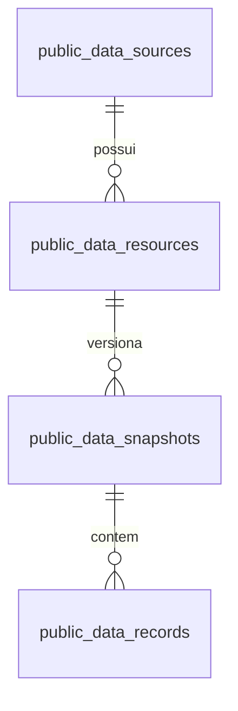

# Persistência de dados oficiais

Infraestrutura compartilhada por fontes, estados, municípios e trilhas. O primeiro adaptador é receita realizada de Minas Gerais. A coleta do catálogo existente deriva seus recursos do mesmo model usado pela interface; cadastrar uma nova fonte exige um adaptador validado, não novas rotas ou tabelas por estado.

## Contrato

| Estrutura | Responsabilidade |
|---|---|
| `public_data_sources` | Fonte reutilizável, órgão responsável, jurisdição, URL oficial e conceitos/limitações |
| `public_data_resources` | Recurso concreto, ID oficial quando existe, formato, versão ativa e `last_check` (horário, HTTP, resultado/evidência da última tentativa) |
| `public_data_snapshots` | Versão coletada: hash do original e do contrato (schema + IDs das dependências), parser, Storage, data, estado e evidências |
| `public_data_records` | Registros da versão: ordem original, ano de referência opcional, chave opcional e payload estruturado |
| Storage `official-data` | Arquivo original preservado, caminho por fonte/recurso/SHA-256; privado e sem overwrite |



Uma etapa de trilha poderá referenciar recursos já cadastrados. Essa fatia ainda não cria as entidades de trilhas nem altera a interface. O catálogo anterior continua disponível; as rotas novas consultam a persistência.

O payload é JSON estruturado e suporta campos e objetos definidos por cada fonte. O adaptador de receita mantém códigos e valores monetários como strings, acompanhados do schema oficial. Isso evita perda de zeros e arredondamento em JSON/JavaScript. O adaptador valida o tipo e a precisão. Agregações futuras devem usar casts explícitos para `numeric` no Postgres, com conceito e unidade definidos pelo recurso. Views/tabelas analíticas específicas só serão criadas quando houver consulta validada que as justifique.

## Matriz de acesso

| Acesso | Postgres | Storage |
|---|---|---|
| Backend/importador com service role | Ler/escrever catálogo e snapshots; publicar por RPC | Criar bucket privado, gravar/ler originais e gerar links temporários |
| Visitante pela API Express | Fontes e versões prontas; paginação; link do original válido por 60 segundos | Download pela URL assinada retornada pelo backend |
| anon/authenticated direto no Supabase | Sem grants nas tabelas e RPCs; RLS habilitada sem políticas permissivas | Sem políticas de leitura ou upload nos objetos |

As novas RPCs são `SECURITY INVOKER`, têm `search_path` vazio e execução restrita à service role. Não há alteração em `users`, `dossiers`, Auth ou políticas pré-existentes. As fontes desta CLI são dados oficiais públicos curados; dados pessoais de despesas e outras fontes precisam de avaliação própria no adaptador antes de exposição.

## Importar

Do diretório `backend`, com suas variáveis `SUPABASE_URL` e `SUPABASE_SERVICE_ROLE_KEY` configuradas:

```bash
npm run data:import -- mg-revenue
```

Em produção, as mesmas variáveis vêm do ambiente. Nenhum segredo entra no frontend. O importador precisa das tabelas/RPCs previamente aplicadas via Management API; ele cria o bucket quando ausente e recusa bucket público ou limite divergente.

O pipeline em `services/importOfficialData.ts` controla coleta, originais, lotes, falhas e publicação. `types/officialData.ts` define o contrato de adaptadores. O registro confiável está em `scripts/importOfficialData.ts`; a CLI aceita apenas o identificador da fonte, nunca uma URL arbitrária. Um adaptador informa hosts oficiais permitidos, descoberta, recursos em ordem de dependência, schema, parser e validações. Recursos opcionais podem falhar sem interromper a preservação de uma tabela independente; o adaptador registra relações pendentes explicitamente. Transporte segue `officialHttpGet`, incluindo a validação de host em redirects.

Um recurso pode fornecer `load` para reutilizar um cliente existente quando a origem exige protocolo específico. No catálogo paulista, esse callback captura os bytes SOAP pelo cliente de Fazenda SP. A CLI usa a cadeia ICP-Brasil já presente em `backend/certs/icp-brasil-v10.crt`; a verificação TLS permanece habilitada.

Não há agendamento automático nesta entrega. A atualização é administrativa pela CLI. Um futuro cron pode chamar o mesmo pipeline, sem colocar importações nas requisições dos visitantes.

## Publicação e falhas

1. Consultar fonte oficial e schema.
2. Calcular SHA-256; reutilizar snapshot pronto com mesmo conteúdo/contrato/parser. O campo `schema_sha256` inclui schema e dependências ordenadas, evitando reutilização silenciosa quando uma dimensão muda de versão.
3. Gravar original imutável no Storage. Se o caminho já existir, conferir o hash antes de reutilizar.
4. Criar snapshot `staging`, processar e inserir registros em lotes de 500.
5. Validar schema, campos, chaves e relacionamentos definidos pelo adaptador.
6. RPC `publish_public_data_snapshot`: bloquear o recurso, conferir contagem e dependências prontas, marcar `ready` e trocar o ponteiro em uma transação. Snapshot mais antigo não substitui um mais recente; publicação concorrente do mesmo conteúdo é deduplicada.
7. Em falha, marcar `failed`; a versão ativa anterior permanece. Originais e linhas parciais ficam para auditoria.

Storage e Postgres não participam da mesma transação. Interrupção abrupta pode deixar um objeto órfão ou snapshot `staging`; eles não são visíveis na API. A reexecução consegue reutilizar o objeto pelo hash e criar uma nova tentativa. Ainda não há limpeza automática nem política de retenção. Não remover objetos por SQL em `storage.objects`.

Limites atuais: objeto armazenado de até 30 MiB, CSV gzip de receita descompactado de até 50 MiB, página de até 200 registros. Os adaptadores de arquivo legislativo permitem download/descompactação de até 128 MiB e preservam textos com gzip reversível. Esta infraestrutura não é um crawler universal nem transforma qualquer API sem validação.

O teto inicial de 6 MiB era uma decisão do projeto. O usuário autorizou ampliá-lo para 30 MiB em 09/10/2026: `ORIGINAL_MAX_BYTES`, limite privado do bucket e constraint `public_data_snapshots_byte_size_check` passaram a 31.457.280 bytes. O DDL foi validado com rollback antes de aplicar o mesmo SQL com commit pela Management API. A conferência posterior confirmou o mesmo teto no bucket e no Postgres, bucket privado e nenhum snapshot acima do limite. Não houve mudança de plano contratado, grants, RLS ou novas tabelas.

## API pública

Todos os resultados seguem `{ success: true, data: ... }`; erros seguem o envelope canônico.

```text
GET /data-sources/persisted
GET /data-sources/persisted/:sourceId/resources
GET /data-sources/persisted/:sourceId/resources/:name/preview?page=1&limit=20&year=2025
GET /data-sources/persisted/:sourceId/resources/:name/original
```

`preview` consulta exclusivamente Postgres; aceita tabelas e dimensões. `year` é opcional, usa o ano de referência definido pelo adaptador e não implica exercício completo. A resposta contém `snapshotId`, página, tamanho, contagem e registros com `row_number`, `reference_year`, `record_key` e `payload`. Documentos sem parser tabular são acessados pelo original. A lista de recursos apresenta schema, evidências e dependências da versão pronta; recurso sem versão aparece com snapshot nulo.

As listas de fontes e recursos também aceitam `page` e `limit` (padrão 50, máximo 100) e retornam `items`, `total`, `page` e `pageSize`, com ordenação determinística. Não se presume que uma única leitura PostgREST retornou todo o catálogo.

`last_check` distingue acesso ao documento, registros consultados e falha. `latestAttempt` apresenta o último snapshot, incluindo falhas de conteúdo; uma falha HTTP sem corpo ainda fica registrada em `last_check`. Nenhum desses resultados implica reconciliação contábil: verificar sempre as evidências do snapshot ativo.

## Primeira fonte

Receita MG: CKAN `package_show?id=receita`, datapackage oficial, fato `ft_receita_v2018` e suas 11 dimensões. Registrar o resultado de cada relacionamento pelo schema e confrontar o ano com `dm_tempo_mensal`; nunca converter `id_tempo` diretamente em data. O adaptador preserva negativos e distingue vazio de zero. A cobertura anterior a 2018 e os arquivos de receita prevista ainda não são importados.

A coleta real de 08/10/2026 encontrou quatro dimensões sem registros (`dm_desdobramento_1_rec`, `dm_desdobramento_2_rec`, `dm_desdobramento_3_rec`, `dm_item_rec`) e outras com cobertura limitada (`dm_especie_rec`, `dm_fonte_rec`, uma linha cada). Elas não podem fornecer rótulos para toda a receita. Os originais vazios ficam preservados com snapshot `failed`; a receita pode ser consultada com códigos originais, schema e decimais validados, mas `dimensionLinksValidated` e `dimensionLinks` informam as lacunas. `ready` significa versão disponível para leitura, não aprovação de um indicador fiscal ou de todos os relacionamentos.

## Originais do catálogo existente

Escopo confirmado pelo usuário: primeiro somente o catálogo de arquivos. As bases das telas legislativas de deputados, senadores e votações não fazem parte desta coleta.

```bash
npm run data:import -- catalog
```

Também é possível importar uma fonte individual: `senado-dotacao-e-despesas`, `senado-receitas-proprias`, `senado-demonstracoes-contabeis` ou `sp-execucao-investimentos`.

| Fonte | Recursos previstos | Representação preservada |
|---|---:|---|
| Dotação e despesas do Senado | 2 | CSV e JSON oficiais |
| Receitas próprias do Senado | 2 | CSV e JSON oficiais |
| Demonstrações contábeis do Senado | 36 | Seis relatórios CSV por ano, 2020–2025 |
| Investimentos de São Paulo | 17 | Resposta SOAP XML integral por exercício, 2010–2026 |

`adapters/catalogArchive.ts` deriva IDs, URLs e edições de `DataCatalogModel`, sem manter uma segunda lista de arquivos. Cada recurso preserva a requisição no `schema_document`: método, URL, edição e, para SOAP, parâmetros, envelope e headers públicos. A coleta guarda o XML completo antes de selecionar naturezas 44/45. Erro semântico no SOAP não transforma o retorno em zero: o original pode ser preservado em snapshot falho e o erro é registrado.

Esta coleta usa `kind=document`: os arquivos originais e evidências entram na persistência, e suas linhas não são duplicadas em `public_data_records`. `archiveOnly=true` distingue essa preservação do processamento analítico. A validação usa os parsers existentes para detectar corpo vazio, HTML de erro, JSON inválido, relatório incompatível e erro declarado pelo SOAP.

O preview existente (`GET /data-sources/files/:id/preview`) busca primeiro o original da versão ativa no Storage e confere seu SHA-256. Para São Paulo, a seleção 44/45 é refeita localmente a partir do XML. Ausência explícita de versão libera o acesso oficial anterior; erro de banco, download ou integridade é propagado e não vira cache miss. Todos os recursos cadastrados e preservados passam a usar Storage no preview, sem consulta ao governo.

O armazenamento continua privado; o bucket permite `application/xml` e os MIME types previamente autorizados. Esta carga foi feita sob o teto inicial de 6 MiB; o teto atual é 30 MiB. A CLI imprime um resumo por fonte e termina com código 1 quando alguma verificação falha, mesmo que existam outros recursos válidos. A última versão válida continua disponível.

Ainda há download e parsing do original por preview. Esta fase remove a dependência dos portais oficiais para arquivos preservados; paginação de linhas diretamente no Postgres e cache de parsing ficam para a evolução das consultas.

A carga de 08/10/2026 preservou os 57 recursos previstos, todos com versão ativa `ready` e sem falhas de verificação. São 15.636.519 bytes adicionais. Com os 14 originais de Minas, o bucket contém 71 objetos e 19.702.515 bytes; o maior arquivo tem 2.856.011 bytes. Nenhuma nova tabela ou RPC foi necessária nesta ampliação.

Validações desta carga:

- 57 rotas reais de preview retornaram HTTP 200 com registros: 36 relatórios e 21 tabelas. Durante o smoke, GET/POST para domínios governamentais estavam bloqueados; houve zero tentativas de consultar essas origens. Cada leitura conferiu o SHA-256 do original.
- O início de snapshot foi repetido para os mesmos 57 conteúdos/contratos/parsers: todos retornaram `reused=true` e o ID da versão ativa. Essa verificação usou os originais já preservados, sem afirmar uma nova consulta ao governo.
- Inventário SQL confirmou 57 snapshots, todos `ready`, um por recurso destas quatro fontes.
- Cinco suítes Jest filtradas passaram, com 32 testes: `catalogArchive`, `fetchSpFazendaExpenses`, `dataCatalogModel`, `importMgRevenue` e `officialDataRoutes`.

Os dados foram gravados no Supabase configurado. A alteração dos previews está no código do backend do repositório; esta operação não publicou uma nova versão do servidor.

## Inventário e arquivos legislativos da Câmara e do Senado

O usuário ampliou o escopo anterior para estas duas Casas. A primeira seleção é legislatura atual e cadastros necessários; o histórico de votações foi incluído, com corte de coleta em 2000. Os períodos anteriores permanecem no inventário. Arquivos que já haviam sido coletados antes do ajuste de corte ficam para rastreabilidade; não há exclusão automática. Cadastros consolidados e catálogos oficiais são preservados integralmente e podem descrever períodos anteriores a 2000.

```bash
npm run data:import -- legislative
npm run data:import -- legislative --resume
```

Também são aceitos os IDs `camara-published-files` e `senado-published-files`. `--resume` evita reconsultar documentos prontos, com a mesma URL e sem última falha. Catálogos já obtidos na descoberta continuam sendo verificados; arquivos ausentes, com falha ou mudança de URL são coletados. A retomada não atualiza artificialmente a data de acesso dos documentos ignorados. Importações normais continuam atualizando as fontes.

`adapters/legislativeArchive.ts` descobre o índice JSON publicado na página oficial da Câmara, sem executar scripts. Cada recurso corresponde a uma base/período, com uma representação preferencial; os demais formatos estão documentados em `alternativeFormats`. Arquivos técnicos temporários e caminhos inseguros são excluídos. Os arquivos da legislatura atual cobrem votações, votos, proposições, autoria, temas, tramitação, eventos, presença, requerimentos, licitações e cotas; os cadastros incluem deputados, órgãos, partidos, frentes, grupos e legislaturas. As séries anuais de votações são selecionadas desde 2000, quando anunciadas pelo catálogo. As famílias têm coberturas diferentes; não criar anos ausentes.

Para evitar JSONs de grande volume ou incompletos, a preservação de proposições, votos individuais, participantes de frentes e histórico de deputados prioriza o CSV oficial, e cotas usam CSV ZIP. Isso não converte uma resposta de API em CSV: são representações de download anunciadas pelo próprio órgão. Arquivos JSON já preservados permanecem como versões anteriores. A inspeção de CSV é linear e registra cabeçalho, contagem de registros, aspas e divergências de largura, sem materializar milhões de células ou calcular indicadores.

No Senado, o CSV geral fornece links, órgãos responsáveis, descrições, periodicidade declarada e dicionários; linhas incompletas são contabilizadas e o original integral é preservado. Cinco páginas legislativas complementam a descoberta: senadores, projetos/matérias, comissões, plenário e composição. Os links administrativos e de documentação entram como identificados; essa seleção não coleta automaticamente cada endpoint, cada documento ou cada parâmetro individual dessas APIs. Downloads legislativos anunciados, cadastro de senadores em exercício e consultas anuais de votações desde 2000 compõem a preservação. Coleções ZIP sem recorte temporal confirmado ficam identificadas, fora desta seleção.

Os dois adaptadores confirmam a legislatura pela definição oficial, em vez de inferi-la do ano. Arquivos/consultas anuais integrais podem conter janeiro anterior ao início da legislatura; o filtro exato pelas datas pertence à consulta analítica. Extratos CSV do Senado podem conter só os últimos 12 meses. Uma consulta anual vazia é arquivada como resposta vazia (`empty=true`), sem inferir ausência de votações naquele exercício; a cobertura precisa de validação própria.

A fase de coleta usou `kind=document`, sem gerar linhas legislativas em `public_data_records`. O carregamento das telas foi adaptado na entrega de leitores descrita abaixo. Fontes e recursos são acessíveis pela API compartilhada `/data-sources/persisted`; originais válidos usam links assinados. Os identificadores oficiais preservam maiúsculas, como `eventosOrgaos-2026`, aceitas e testadas pela rota.

Textos comprimidos registram `storageEncoding=gzip`, `originalFormat`, `originalByteSize` e `originalSha256`, além do hash do objeto no Storage. A API de download devolve esses campos; o arquivo servido é `.json.gz`, `.csv.gz`, `.xml.gz` ou `.html.gz`. `storedOriginal` verifica o hash armazenado, descompacta com limite e verifica o hash/tamanho oficial. A compressão não reserializa JSON, não modifica CSV e não arredonda valores. CSVs legislativos inspecionados pelo parser atual usam `legislative-csv-archive-v2`; versões anteriores mantêm as evidências da validação original.

Falhas de download, limites, conteúdo inválido e documentação sem parâmetros suficientes são registradas; localizar um link não implica integração funcional. Textos de erro são sanitizados para remover NUL, que o Postgres não aceita em `text/jsonb`. O Swagger UI do Senado consultado apontava para Petstore; ficou registrado como problema de documentação, sem assumir que ele descreve os endpoints do Senado.

Fontes oficiais: [Catálogo e formatos da Câmara](https://dadosabertos.camara.leg.br/swagger/api.html), [conceitos e limitações de votações](https://dadosabertos.camara.leg.br/howtouse/2020-02-07-dados-votacoes.html), [catálogo/dicionários CSV do Senado](https://www12.senado.leg.br/dados-abertos/geracsv), [arquivos de senadores](https://www12.senado.leg.br/dados-abertos/conjuntos?portal=Legislativo&grupo=senadores).

### Resultado da coleta em 09/10/2026 (UTC)

| Fonte | Recursos catalogados | Originais ativos disponíveis | Apenas identificados | Última tentativa indisponível |
|---|---:|---:|---:|---:|
| Câmara | 871 | 238 | 631 | 2 |
| Senado legislativo | 389 | 141 | 248 | 0 |

São 1.260 recursos legislativos catalogados e 379 originais ativos. Recursos agrupam uma base/período; formatos alternativos não são contados como bases diferentes. As contagens disponíveis incluem 29 arquivos anteriores a 2000 coletados antes de fixar o corte e um ZIP do Senado preservado antes de retirar coleções sem período confirmado da seleção. A execução atual não inicia a coleta desses arquivos excluídos.

As versões CSV resolveram as pendências de `proposicoes-2025`, `votacoesVotos-2021`, `frentesDeputados` e `historicoDeputados`. A consulta do Senado de 2012 respondeu inicialmente 503 e foi preservada na retomada. As 27 consultas anuais de 2000–2026 retornaram JSON não vazio, com contagens documentadas; isso não demonstra cobertura histórica completa nem validade das datas. Os consumidores atuais mantêm seu recorte desde 2019, que já exclui as inconsistências anteriormente identificadas em 2015–2016.

As duas pendências restantes são `historico` e `membros` da Câmara: os links anunciados responderam 404, inclusive nas alternativas CSV conferidas. O dicionário CSV do Senado tem 2.227 registros inspecionados, 211 divergências de largura e 205 linhas sem URL/categoria aproveitável; conservar o original e registrar validação semântica pendente evita apresentar esse catálogo como schema inteiramente validado. Os demais CSVs ativos inspecionados não apresentaram divergências de largura.

O bucket completo contém 481 objetos, 328.381.030 bytes, incluindo as fontes anteriores, versões históricas e tentativas inválidas preservadas para auditoria. Nenhum snapshot está em `staging` ou acima de 30 MiB. Não houve deploy do backend nesta coleta.

Validação final às 03:28:48 UTC: leitura dos 379 originais ativos pelo Model, com SHA-256 do objeto e do conteúdo descompactado conferidos (2.976.846.918 bytes originais); inventário paginado pela API Express local; quatro downloads assinados conferidos, incluindo identificador camelCase, CSV grande, ZIP e consulta anual de 2000. Recursos não disponíveis retornaram 409 e documentos sem registros tabulares retornaram 422. Toda a verificação foi feita com chamadas a domínios governamentais bloqueadas, sem nenhuma tentativa de acesso a essas origens. Isso valida os leitores de arquivo/inventário, não as telas legislativas ainda pendentes. Cinco suítes filtradas passaram, totalizando 32 testes; o teste HTTP precisou permissão para abrir a porta local após a sandbox bloquear seu primeiro ensaio. Build/lint/typecheck não executados pelo agente, conforme a regra do repositório.

### Leitores das telas legislativas — implementados em 09/10/2026 (UTC)

O frontend mantém suas rotas Express. `fetchSenado.ts` e `fetchCamara.ts` leem o acervo pelo `OfficialDataModel.readArchive`: resolve a URL oficial exata para o snapshot ativo, exige estado `ready`, verifica SHA-256 do objeto e do conteúdo descompactado e devolve procedência/data. Snapshot inexistente produz 503; erros de banco/Storage não disparam fallback para o governo. Ambiguidade de recursos ativos para a mesma URL também é recusada. Uma versão fixada pela paginação continua acessível por seu ID e URL, mesmo quando existe uma versão mais nova.

- Senado: os JSONs anuais desde 2019 e a lista de senadores em exercício alimentam os normalizadores existentes. O filtro de votação secreta, votos desconhecidos e datas de mandato permanece. Histórico desde 2000 continua preservado no catálogo; não ampliamos o recorte das telas para a janela anteriormente identificada como inconsistente.
- Câmara: JSONs de votações/proposições afetadas e CSV de votos alimentam o mesmo dataset. `parseArchiveCsv` preserva strings, aspas, quebras de linha e códigos; rejeita cabeçalho duplicado, colunas divergentes, NUL e truncamento. A conferência de placares permanece obrigatória.
- Cadastros atuais: `camara-current-deputies` preservou seis páginas e 513 deputados. O primeiro snapshot é publicado por último, com dependências das outras cinco versões; o leitor segue esses IDs e recusa uma próxima página sem vínculo. Assim, uma atualização parcial não mistura páginas de coletas diferentes.
- Tramitação: `senado-current-processes` preservou a resposta de PEC 221/2019 usada em `LegislativeJourneyModel`. As consultas são derivadas da configuração existente; acrescentar outra trilha permite coletá-la pelo mesmo adaptador, sem repetir URLs no frontend.
- `collectedAt` é a data real mais antiga entre os arquivos usados pelo payload, ou a data da resposta específica de tramitação. Não recebe o horário da visita como substituto. `sourceUpdatedAt` da Câmara fica nulo quando o original não contém evidência de data de atualização do órgão.

Operação, a partir de `backend`:

```bash
npm run data:import -- legislative-screens
npm run data:import -- senado-published-files
npm run data:import -- camara-published-files
```

A primeira chamada atualiza os novos cadastros/tramitações; as outras atualizam o acervo legislativo já existente, conforme a seleção documentada. `--resume` repara pendências e evita baixar novamente arquivos prontos; não deve ser usado para solicitar atualização completa. Ainda não existe cron. Os caches atuais evitam repetir parsing/download do Storage por até seis horas na Câmara e uma hora no Senado; uma importação nova aparece após expiração do cache ou reinício do backend.

Validação HTTP real com caches em memória limpos e origens governamentais bloqueadas:

| Verificação | Resultado |
|---|---|
| Listas e detalhes de deputados, senadores e votações; tramitação existente | Nove respostas 200 pelo Express local |
| Cadastro atual | 513 deputados e 81 senadores |
| Recorte consumido | 122 votações públicas nominais da Câmara em 2026; 586 votações nominais do Senado em 2019–2026, conforme filtros existentes |
| Arquivos usados | 19 leituras verificadas no Supabase; cinco páginas fixadas na coleta de deputados |
| Identificadores inexistentes | Cinco respostas 404, sem consulta externa |
| Arquivo não coletado | Recusado com `ARCHIVE_RESOURCE_NOT_READY` |
| Acesso ao governo | Zero chamadas/tentativas durante o smoke |
| Procedência | Datas dos payloads pertencem aos snapshots efetivamente lidos |
| Regressão financeira | Todos os 57 previews existentes passaram com SHA-256 conferido e governo bloqueado |

Novas fontes reutilizam as tabelas, bucket privado, RLS e pipeline existentes. Nenhum DDL, serviço adicional, agendamento ou deploy nesta entrega. Quinze suítes filtradas, com 90 testes distintos, passaram; cobrem leitura/hash, corrupção, seleção ativa/rollback, paginação fixada, CSV, normalização, importação e erro de armazenamento. O smoke final das telas terminou às 03:47:38 UTC; `git diff --check` passou.

Para o fechamento dos commits, o usuário autorizou o agente a executar o quality gate: `npm run typecheck` e `npm run lint` passaram nos dois workspaces, lint sem avisos. Corrigidas as causas dos erros agregados do importador, a remoção de NUL sem regex de controle e as dependências do efeito do resumo por gestão. Duas suítes backend afetadas passaram (16 testes) e a suíte da tela passou (21 testes), incluindo regressão para atualização dos totais sem repetir consultas. Build do backend passou; build de produção do frontend passou com `npm run build -w frontend -- --webpack`. O build padrão com Turbopack foi bloqueado pelo ambiente ao abrir sockets internos (`EPERM`), após liberar o download das fontes; nenhuma configuração de build foi alterada. Esse limite do bundler padrão permanece registrado, mesmo com o build Webpack aprovado. A publicação fica restrita à branch `feat/fonte-dados`, sem deploy.

Dados importados não constituem indicadores reconciliados. O exercício corrente é parcial; receita do Estado não é PIB. O fechamento anual, as deduções e a consolidação com Siconfi/RREO/DCA ainda precisam de investigação.

## Schema e rollback

DDL aplicado via `curl` na Management API conforme `.claude/CLAUDE.md`, primeiro com `begin/rollback`, depois com commit; nenhum arquivo SQL de migration no repositório. Objetos novos: quatro tabelas, seus índices/FKs e RPCs `publish_public_data_snapshot(uuid)` e `read_public_data_page(uuid,integer,integer,integer)`.

Rollback operacional: interromper a CLI e retirar as novas rotas. Para reverter uma publicação, selecionar um snapshot `ready` anterior do mesmo recurso e alterar `active_snapshot_id` em transação via Management API, registrando o motivo. Não excluir snapshots ou originais automaticamente. O ponteiro é protegido por FK composta para impedir referências a snapshot de outro recurso.

## Validação

Executar apenas testes Jest filtrados, conforme a regra do repositório:

```bash
npm test -- --runInBand --runTestsByPath src/tests/officialData.test.ts src/tests/importMgRevenue.test.ts src/tests/officialDataRoutes.test.ts src/tests/fetchSourceFile.test.ts
npm test -- --runInBand --runTestsByPath src/tests/catalogArchive.test.ts src/tests/fetchSpFazendaExpenses.test.ts src/tests/dataCatalogModel.test.ts src/tests/importMgRevenue.test.ts src/tests/officialDataRoutes.test.ts
```

Build, lint, typecheck e validação visual ficam com o desenvolvedor. As verificações remotas devem conferir contagem, hashes, snapshots ativos, constraints, RLS, grants e invoker das RPCs; testar download assinado e negação anônima separadamente. Nunca usar sucesso com service role como prova de RLS.

Evidências da primeira carga de Minas em 08/10/2026 (a ampliação do catálogo está descrita acima):

| Verificação | Resultado observado |
|---|---|
| Management API | DDL validado em rollback e aplicado; quatro tabelas com RLS, FKs/constraints e RPCs invoker conferidas |
| Bucket | `official-data` privado, limite 6 MiB, MIME types restritos |
| Originais | 14 objetos; download e SHA-256 de todos conferidos, incluindo os vazios |
| Receita | 77.755 registros, anos 2018–2026; contagem total e por ano conferida por leitura CSV independente e SQL |
| Reexecução | Uma única versão de receita e 77.755 linhas após reexecuções; conteúdo válido reutilizado |
| Dimensões | Cinco relacionamentos validados; seis pendentes (quatro arquivos vazios e dois incompletos) |
| API HTTP real | Listas e registros paginados, filtro de ano, decimais textuais, último resultado e download assinado conferidos |
| Acesso direto anônimo | Tabela e RPC recusadas com `42501`; Storage privado recusou download sem assinatura |
| Papel authenticated | Sem privilégios nas novas tabelas/RPCs, conferido no inventário; não foi utilizado JWT de usuário real neste smoke |
| Publicação inválida | Teste SQL com rollback: receita vazia rejeitada pela RPC; ponteiro válido preservado |

Os primeiros snapshots históricos de metadados e duas dimensões usaram hash apenas do schema. A versão atual do pipeline inclui as dependências no hash de contrato e não reutiliza esses snapshots antigos. Os originais continuam íntegros; as versões ativas seguem o contrato atual.

Fontes técnicas da operação: [Supabase Storage — buckets](https://supabase.com/docs/guides/storage/buckets/creating-buckets), [uploads](https://supabase.com/docs/guides/storage/uploads/standard-uploads), [controle de acesso](https://supabase.com/docs/guides/storage/security/access-control). Fonte oficial dos dados: [Receita pública — Dados Abertos MG](https://dados.mg.gov.br/dataset/receita).
